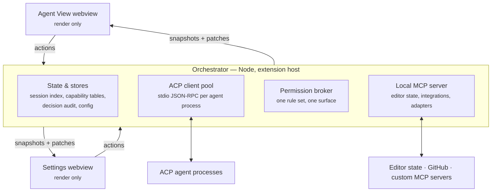

# acp-patchbay — Architecture

How the product surface becomes a VS Code extension. Inputs: [prd.md](prd.md) (why)
and [features.md](features.md) (what); on any conflict, they win. This document
decides mechanisms and records the reasoning. Stack is fixed by rule: TypeScript
for all extension-host code, esbuild, npm.

---

## Vocabulary

Terms are contracts — one meaning each, held everywhere (docs, code, UI copy):

- **Orchestrator** — the Node process in the extension host. Single source of truth
  for sessions, capability tables, permission rules, secrets, configuration.
- **Agent View** — the one blended webview: agents + sessions + chat. Not three panels.
- **Session index** — patchbay's registry of session IDs, titles, timestamps, agent.
  Exists because ACP has no session enumeration.
- **Decision audit** — append-only record of events that happened *in patchbay*:
  permissions granted, tools approved, routing chosen.
- **Render cache** — disposable render state, rebuilt wholesale from `session/load`
  replay. Never merged, never reconciled.
- **Declared / used** — the two capability states: claimed at `initialize` vs.
  observed firing on the wire.
- **Brokered** — routed through the permission broker. Fidelity labels: fully
  brokered / partially brokered / acts outside the permission flow.
- **Integration** — the *record*: a configured MCP-server connection (curated or
  custom) with its credential, env, routing, and active state. The UI calls the
  surface "MCP Servers" (that's what they are); the internal type keeps the name
  `integration` because the ACP SDK owns `McpServer` for the *wire config* an
  integration produces into a session — two different things, two names, held.
  Lifecycle is two-state: active/inactive (the mute switch — everything kept,
  nothing routed) and disconnect = full clear (credential + env + config; a
  curated entry reverts to the catalog). Nothing is stored until it can work —
  a cancelled OAuth consent adds nothing.
- **Branch** — the user-level concept: continue an alternate path from a session.
  `session/fork` is one mechanism that implements it; emulated seeding is the
  other. "Fork" only ever names the protocol method.
- **Routing** — the user's per-agent selection of which integrations that agent
  receives.

## Core principle

**ACP answers where the agent lives** — sessions, prompts, permissions, file
operations, terminal. **MCP answers what the agent reaches** — tools, resources,
context. Everything ACP doesn't model (live editor state, integrations) is exposed as
a **local MCP server the orchestrator owns**, passed into `session/new` via
`mcpServers`. This is the generic version of the pattern vendor extensions build
privately — it works for any ACP agent by construction, with zero per-vendor code.

## Architecture



Data flows one way: webviews send **actions**; the orchestrator sends **snapshots and
patches**. No business logic, persistence, or protocol handling in webview code —
webviews are disposed when hidden and must rehydrate losslessly on every mount.

## UI layer

Two webviews and one near-empty native settings page:

1. **Agent View** — the single blend (features §1). Its layout is the owed design
   deliverable; what architecture fixes now is its information boundary: it knows
   only its current snapshot + patch stream, and can only emit actions. Anything the
   layout wants to show must arrive through that pipe — which is the whole
   rehydration guarantee.
2. **Settings** — agents and launch config, capability matrix, integrations,
   routing, permission rules. Structured data, low frequency, same render-only
   contract.
3. **VS Code native settings** — flat scalars only (default agent, telemetry
   opt-in). Never credentials: `settings.json` syncs.

Native surfaces — the status bar item (active session, connection health, usage),
permission notifications, and command palette entries — are direct orchestrator
consumers: same state, no webview in the path.

> Agents, sessions, and chat are one surface (features §1). Settings remains its
> own webview because it is genuinely a different activity, not because panels
> are cheap.

How both webviews are *built* — one shared component layer (shadcn/Radix on
React, Codicons, a single VS Code-theme bridge) and the chat transcript
rendering pipeline (Streamdown markdown, the ordered block model, tool-call
cards) — is decided in
[design/ui-rendering-strategy.md](design/ui-rendering-strategy.md); the split
above is about state and lifecycle, never visual identity.

### Snapshot + patch protocol — decided

One protocol, one shared TypeScript module (`src/shared/protocol.ts`) both sides
import. No diffing library, no CRDT, no partial hydration:

- **Actions** (webview → orchestrator): a discriminated union — `prompt`, `stopTurn`,
  `switchSession`, `grantPermission`, `connectAgent`, … Fire-and-forget; results come
  back as state, never as replies.
- **Snapshot** (orchestrator → webview): the complete view model for that webview,
  tagged with a monotonic revision. Sent on mount and whenever the webview asks.
- **Patch** (orchestrator → webview): `{ rev, events[] }` — semantically named events
  (`sessionUpdated`, `agentStatusChanged`, `permissionRequested`, …) applied by pure
  reducers in the webview. A webview that sees a revision gap discards its state and
  requests a fresh snapshot. Recovery is always "resnapshot," never "repair."
- **Coalescing**: the orchestrator buffers high-frequency `session/update` streaming
  chunks and flushes one patch per short fixed interval (~30 ms) or turn boundary,
  concatenating text chunks per message. One knob, no adaptive machinery.

One mechanism sized to the actual problem: webviews die and must resurrect
cheaply.

## State — three honest stores, no co-equal copy

The agent owns the conversation (features §1). Patchbay holds exactly three things,
each with different truth semantics, so each gets different placement:

| Store | Contents | Placement | Why |
|---|---|---|---|
| Session index | IDs, titles, timestamps, agent, last agent-confirmed knob state | `workspaceState` | Small, machine-local, non-sensitive; confirmed knob state seeds emulated continuations (§ Session model) |
| Decision audit | Permission/routing events | JSONL in workspace storage | Append-only, grows, belongs to patchbay |
| Render cache | Current render state | Memory; rebuilt from `session/load` replay | Disposable — replay always wins |
| Last-known view | Render cache persisted, labeled "patchbay's view, up to \<time\>" | Files in workspace storage | Only for agents without `session/load`; a labeled fallback, not a competing truth |
| Agent + integration configs | Agents (launch config, defaults), integrations, routing | `globalState` stores | Developer-env, not code-env: global to this machine, never a repo-committed file; no credentials ever |
| Permission rules | Command allowlists, file-write scopes | `workspaceState` (workspace layer) + `globalState` (machine-layer command rules) + built-in defaults | Workspace rules evaluated first, machine rules the fallback floor, then ask. Per-user either way, never repo-shipped — a cloned repo must not arrive pre-authorized |
| Secrets | OAuth tokens, API keys, env values (agents *and* custom-stdio MCP servers) | `SecretStorage` | The only place. Never settings, never state stores, never logs. Env values are how agents and stdio MCP servers commonly take API keys, so the whole env record is a secret (`stores/secret-env.ts`); config records carry no env, webview snapshots carry key names at most, and values are read at the last moment reality needs them — agent spawn, or MCP attach (where the handoff to the agent is inherent: the agent spawns stdio servers itself). HTTP integration credentials never ride agent-visible config at all — the bridge IPC-fetches its token at runtime |

Agents and integrations are deliberately global-only. (This supersedes the
earlier `.vscode/acp-patchbay.json` workspace-config design and the
workspace-scoping that fell out of it.) The MCP incident that shaped the old
rule — a production-access MCP server silently following a user between repos —
is guarded where the risk actually lives: a shared/pasted config never carries
its credential; the token reattaches only when its recipient explicitly
connects. Binding configs to workspaces (workspaces, not repos) may return
later as an opt-in; the extension point is visible, deliberately unfilled.

## ACP client pool & process model

- Registry: `agentId → { process, declared, used, sessions[] }`.
- Different agents are always separate subprocesses. Sessions with the *same* agent
  multiplex over one connection by default — that is the protocol's own model
  (`session/new`/`load`/`close` are session-ID-scoped on one connection).
- **Per-agent process policy** (Settings): `auto` (default — share if concurrent
  behavior is *used*, isolate otherwise), `shared` (force, user accepts risk),
  `isolated` (one process per top-level session).
- Protocol fact: `session/fork` is addressed to the connection holding the parent's
  context — no cross-process handoff exists. A branched session therefore rides its
  parent's process under any policy. Shown in the UI, not hidden (features §1).
- Crash → visible immediately; restart is one action. After reconnect: native
  restore where the agent supports it, else a fresh session seeded from the
  last-known view — which kind of continuation happened is shown.

## Agent capability matrix

Two states per capability, per agent — **declared** (from `initialize`, refreshed
every connect) and **used** (set only after the path actually fires on the wire —
whether that's real usage or patchbay's own free connectivity probe; "used" over
"verified" because a single success proves the path fired, not that it's
certified correct). Used is **version-keyed**, not connect-keyed
(`stores/used-capabilities.ts`): a reconnect at the *same* `agentInfo.version`
restores what was already proven immediately, from the persisted cache — it does
not re-run the check. Only an actual version change earns a fresh,
honestly-unused matrix. (This supersedes an earlier "resets on every reconnect"
design — used to reset as a side effect of always rebuilding the matrix fresh on
connect; it's now seeded from the cache first.) UI affordances gate on *used*,
not declared: real bridges have been observed silently dropping `mcpServers`,
collapsing stop reasons, and reporting rejected mode changes as succeeded.
Four honest states per row: not declared / declared-but-not-used / used /
**suspect** — declared, not used, and implicated in at least one failed
request (a wire fact that would have proven the row rode a request that
rejected). Suspicion, not conviction: the failure may not be the row's fault,
so it renders as a warning triangle, never an error, and gates nothing — UI
features still gate on used only. First success acquits (used drops the
flag); `auth_required` never indicts (it's the honest pre-login state, with
its own surface); only outgoing agent RPCs can indict — a client-side handler
throwing is patchbay's own gate rejecting, never the agent failing. Suspect
persists version-keyed exactly like used: a broken bridge must not look clean
after a restart.

Marking a row used is centralized in one **proof table**
(`CAPABILITY_PROOFS`, capabilities.ts) — the single place that knows which wire
fact proves which row. `pool.ts` — the sole channel that talks to an agent on
the wire — consults it at three chokepoints: an outgoing agent RPC resolving
(`session/new` → `auth`, and → `concurrentSessions` when the connection already
served a session; `session/fork` → `session.fork` + `concurrentSessions`;
`session/load` → `session.load`; `session/prompt` → `prompt.image` / `audio` /
`embeddedContext` when the prompt actually carried that block type), an
incoming client request handled (`fs/read_text_file`, `fs/write_text_file`,
`terminal/create` — and `elicitation/create` the moment P7 registers its
handler), and a `session/update` kind tag arriving (`usage_update` → `usage`).
The same table serves both verdicts: a fact riding a successful call marks its
rows used; the same fact riding a failed call marks them suspect. No call site
anywhere names a row; adding a `CapabilityRowId` forces a table entry (the
Record is exhaustive) and nothing else. One `onCapabilityEvidence` hook
carries every hit, called synchronously and never awaited so it can't block
the RPC it's reporting on. `capability-tracker.ts` only decides *when* to run
the synthetic probe below and persists whatever pool.ts reports — it does not
mark anything itself. (Supersedes the earlier per-call-site emits in pool.ts
and orchestrator.ts's own fs/terminal marks — same facts, previously written
at eight scattered points.) session-manager.ts, which decodes `session/update` payloads for
rendering, marks nothing either; the wire-level fact and the render-level
interpretation are two different concerns living at two different layers.

Rows (`CapabilityRowId`, protocol.ts) are **hand-picked** against the ACP spec's
declared capability surface, not derived automatically: `fs.readTextFile` /
`writeTextFile`, `terminal`, `elicitation`, `roots.listChanged`,
`resources.subscribe`, `promptCapabilities.image` / `audio` / `embeddedContext`,
`session.fork` / `load` / `resume`, `mcp.http` / `sse`, usage/context reporting,
concurrent-session behavior. One patchbay-side row rides along: rules/skills/
commands locations (mapped / not mapped), sourced from roster data rather than
the handshake. A new ACP capability needs a row added here before it can show up
at all — a deliberate scope decision (ACP's capability surface is still
settling, and rows need human-curated meaning and a check strategy anyway, so a
schema-driven dynamic list wouldn't remove the manual step), not a limitation.

Verification cost splits the triggers:

| Trigger | Protocol-level (free RPC) | Behavior-level (costs real LLM turns) |
|---|---|---|
| Connect/reconnect: `session/new` always (it doubles as the knob-offering read — offerings are connection state and must be read fresh); the `session/fork` half only while still declared-but-not-used for the current version | Automatic | Opportunistic only — used when naturally exercised |
| User-run diagnostics (Settings § Agents' `Verify…`, itself only shown while a checkable row is still outstanding) | Instant | Allowed; cost disclosed first |
| Background schedule | Fine, cheap | Never |

Connect therefore always implies one throwaway temp-dir session — an accepted
behavioral contract, not an accident: `session/new` is free, the offering read
needs it every connect (see § Session model), and auth/concurrency proof falls
out of the same round-trip opportunistically. The *verification* gates keep
their version-keyed skip: `hasUnusedProbe` (protocol.ts) remains the single
predicate for "a checkable row is still outstanding" — the `session/fork`
sub-check and the manual `Verify…` control's visibility both gate on it, so
the two can't drift on what still needs a check.

Synthetic behavior probes run in an **ephemeral session scoped to a temp directory**
— never the user's workspace roots, never silently.

## Wire log — the opt-in raw-frame tap

Settings § Audit can stream every ACP JSON-RPC frame (the stdio ndjson wire —
there is no gRPC anywhere in this stack) to a dedicated Output channel.
Decisions, recorded:

- **Redaction at the seam, not consent alone.** `session/new`'s `mcpServers`
  array carries the env values patchbay injected for custom-stdio servers —
  real secrets on the wire. Every value patchbay reads out of SecretStorage on
  its way to a session is registered with the wire log and masked before a
  byte reaches the channel (`wire-log.ts`); over-redaction of plumbing values
  is accepted as the safe direction. What an agent echoes back on its own
  initiative cannot be masked — the disclosure prompt says so instead of
  pretending otherwise.
- **Never persisted; TTL-bounded.** Debugging is a session act, not
  configuration: a reload always starts clean, and the log turns itself off
  after 30 minutes unless deliberately extended. While on, a warning-tinted
  status-bar pill shows the countdown; its existence *is* the state. Click →
  stop (fast path) or extend.
- **Tap lives in pool.ts** — the sole channel on the wire — line-assembled so
  redaction always sees whole frames, and zero-cost while off (chunks dropped
  before decode). Frames over 8 KB are truncated with an honest marker.

## Protocol extensions (`_meta`)

ACP reserves `_meta` fields on every type and underscore-prefixed methods for
implementation extensions — a spec-sanctioned mechanism, not a dialect. Adapters
carry real surface there beyond core protocol; observed in `claude-agent-acp`:
`_claude/sdkMessage` (tunnel of the raw Claude Agent SDK stream),
`_claude/rateLimit` (subscription rate-limit windows), `_claude/askUserQuestionOption`
(richer permission options), and a terminal-output `_meta` channel shared as a
convention with `codex-acp` for live command output. The observed pattern:
extensions enrich standard updates in place — `_claude/rateLimit` rides the
standard `usage_update` notification's `_meta` while `used`/`size` stay
protocol-shaped — they don't fork the stream. Token and context reporting is
standard; only the vendor-specific remainder is extension.

Stance: **core ACP is the floor; extensions are per-agent adapter knowledge**,
recorded in roster data and consumed only when a features bullet requires what
core ACP cannot carry. A consumed extension becomes a capability row — present by
observation, used like everything else. Vendor depth that never reaches the
wire (hooks, subagent definitions, skills) is files in `cwd` — the rules/skills/
commands surface is its channel, no protocol involved.

## Branching

- Agent declares `session/fork` *and it's used* → native fork.
- Otherwise → emulated: fresh `session/new` seeded from the parent's replay (or
  last-known view for non-replay agents), labeled emulated.
- Either path is a node in the orchestrator's session graph (parent → branches). The
  UI never knows which mechanism produced a branch; the capability matrix is where
  native-vs-emulated honesty lives.

## Session model, mode, effort

Knobs (model, mode, effort, thinking, …), each existing only if the agent offers
it — model is the only one observed everywhere; the rest are frequent but
optional. The knob set is per-agent reality, not a patchbay form to fill.

**Offerings are read, never stored; selections are stored, never inferred.**
ACP has no session-independent "list the knobs" call — `initialize` carries
capabilities only; the option surface rides `session/new`/`load`/`fork`
*responses* and `session/update` notifications, deliberately per-session state.
And offerings are provider inventory, not build behavior: a provider adds or
removes a model without `agentInfo.version` moving, so no persisted copy can be
keyed honestly. Therefore:

- **Offerings** are connection-scoped, in-memory only: seeded from the
  connect-time read (the free `session/new` every connect performs — see the
  capability matrix section), refreshed by every live session's responses and
  notifications, gone when the connection ends. Settings renders offerings only
  while the agent is connected; stopped agents show stored selections as text.
  (Supersedes the persisted, version-keyed observed-knobs cache — its lifetime
  rule was borrowed from used-capabilities, but "this build's fork worked" is a
  build fact and "these models exist" is not.)
- **Selections** (per-agent defaults, part of the agent's config record; and
  per-session confirmed state, below) are the only persisted artifacts — bare
  ids/values, never lists.
- Patchbay never invents entries, never renders a knob the agent didn't offer.
- Displayed values update only from the agent's subsequent state notifications,
  never from the set-request's success response — bridges have returned success
  for rejected mode changes. What the user sees is the last agent-confirmed
  state, which is the honest one.

**Seeding at session birth** — what gets applied, by how the session came to be:

| Birth | Seed applied |
|---|---|
| Fresh `session/new` | Per-agent defaults, once, via set requests — skipped silently where the option isn't offered |
| Native `session/load` / `session/fork` | Nothing — the agent's own restored/inherited state is the truth; re-imposing a stored copy would force a cache over reality |
| Emulated continuation / branch | The parent session's **last confirmed** combination (recorded from agent notifications, never from what patchbay requested) — the same honesty class as the transcript seed; never the defaults, which the user may have steered away from |

The last-confirmed combination lives on the session-index entry (workspace
state, tiny, leaves with the session) precisely because emulation is the one
case with no reality left to read.

## Local MCP server — editor depth

The differentiator (prd §v1 Scope), shipped complete:

- **Tools/resources**: active selection, current file, diagnostics (live, not
  stale), open editors. Explicit user gestures ("add selection to context",
  right-click) inject the same data into the prompt directly.
- **Context roots**: a session's roots are the workspace folders plus user-added
  external folders (multi-repo work). Delivered protocol-native (`roots` +
  `roots.listChanged` where declared; adapter fallback otherwise). Patchbay
  passes roots and never indexes — retrieval depth is the agent's own engine,
  and the UI never implies otherwise.
- **File operations go through ACP, not MCP**: the orchestrator advertises the `fs`
  capability, so `fs/read_text_file` serves live unsaved buffers and
  `fs/write_text_file` lands as a native diff the user accepts or rejects before
  disk is touched. Permission rules (file-write scope) can auto-accept; the diff
  remains visible either way.
- **Terminal**: orchestrator advertises `terminal`; commands run in a visible
  pseudoterminal, output streams live, gated by the same broker rules as everything
  else.
- **Adapters for uneven MCP client support** — every capability the local server
  uses has a protocol-native path and a tool-call fallback, chosen per connection at
  handshake:

| Capability | Native path | Fallback |
|---|---|---|
| `elicitation` | Elicitation request | Tool `request_user_input(schema)`; orchestrator renders the form, returns the answer as a tool result |
| `roots.listChanged` | Push notification | Roots injected into the next `session/prompt` |
| `resources.subscribe` | Live push | `get_workspace_state` tool; one turn of staleness accepted |

- **Image paste is never disabled**: `promptCapabilities.image` →
  `ContentBlock::Image`; otherwise the image is written to a temp file and sent as a
  `ResourceLink`. Same data, best form the agent accepts (features §1).
- **File attach** (drag-drop or picker): inline `ContentBlock::Resource` when
  `promptCapabilities.embeddedContext` is declared, `ResourceLink` otherwise.

## Integrations

Curated and custom are the same mechanism — MCP servers routed to agents:

- **The registry is shipped data from day one.** prd decides this: GitHub ships
  "proving the registry pattern," and a hardcoded integration proves no pattern.
  One data file, one entry; every field earned by what GitHub demonstrably needs —
  `id`, `name`, transport, auth type, scopes, bridge launch — nothing speculative.
  Adding a curated integration in v2 is a data change, not code.
- **Same pattern for the agent roster**: the known-agents list (name, launch
  command, install hint, asset-convention mapping, known quirks such as bypass
  bridges) ships as data. Roster and registry are the two shipped-data files —
  patchbay-side knowledge lives there, never scattered in code.
- **Custom escape hatch**: add any MCP server (command or URL, with auth).
- **Uniform stdio presentation**: agents vary in declared MCP transports, so the
  orchestrator always hands agents a local stdio server; for remote OAuth services
  it owns a small stdio-to-HTTP bridge process that handles token refresh. Every
  agent sees "just another local MCP server" — no per-agent branching.
- **Routing is the user's, per agent.** Default: a new integration auto-attaches
  only to *fully brokered* agents; anything less requires an explicit plug-in
  (features §2).

## Rules, skills, commands

v1 is management, not delivery: the files live in each agent's **own native
locations** (`.claude/`, `CLAUDE.md`, `.augment/`, …) and the agent reads them from
`cwd` itself — patchbay never passes them down. Settings is where the user sees and
edits them, per agent, in place. No patchbay dialect (prd: not a new protocol), no
injection machinery.

- The per-agent location mapping lives in the roster data; v1 ships Claude Code
  and Augment mappings — the agents in real use. An unmapped agent is shown as
  such — never silently skipped, never guessed.
- Commands the agent advertises back (`available_commands_update`) appear in the
  chat input as autocomplete and are sent as ordinary prompts. This is also the
  only compaction lever besides a fresh session: an advertised `/compact` is just
  one of these commands.
- Parked (v2), stated as a scope decision: a shared base with compatibility
  symlinks into each agent's locations (the
  [dotagent](https://github.com/solutionsunity/dotagent) pattern) or full supply
  by patchbay. v1 proves the management surface first.

## Permission broker

- **One rule set, one approval path** — ACP `session/request_permission`, local MCP
  tool calls, and terminal execution all route through the same broker evaluating
  the same command allowlists and file-write scopes from `workspaceState`.
  A second, differently-scrutinized approval surface is exactly what a malicious
  prompt would target.
- **Rules never ride the repo.** Agent and integration configs are global,
  developer-owned stores — nothing config-shaped lives in the repo at all, so
  no repo-authored launch command exists to adopt. (This supersedes the
  workspace-config-file design and its one-time adoption gate, which existed
  only because that file could be repo-authored by someone else.)
- **Fidelity label is a pure function of the matrix (v1):** `fs` and `terminal`
  declared *and used* → fully brokered; a proper subset → partially brokered;
  neither, or a known-bypass bridge (roster data) → acts outside the permission
  flow. Observed-violation downgrades arrive only with v2 post-hoc change
  detection (parked).
- Protocol fact, load-bearing: an agent can route around `fs/write_text_file` via a
  shell command, and at least one bridge does file I/O invisibly regardless of
  client capabilities. `fs/*` is therefore **not a security boundary** — terminal
  gating carries equal rigor, and each agent wears its permission-fidelity label
  (fully brokered / partially brokered / acts outside) rather than being silently
  trusted.
- Allow-once / allow-always / reject inline in chat; when the Agent View is hidden,
  the same request surfaces as a native notification. One approval surface,
  wherever the user is looking.

## Context usage

Visibility only, not control — compaction is internal to each agent. `usage_update`
is **stable in schema v2**: `used` (tokens currently in context) and `size` (window
size) required, `cost` optional — the numerator and denominator of a context gauge.
Emitting it remains optional per agent, so population is uneven in practice: show
what is reported, omit cleanly when absent, never fake it. claude-agent-acp emits
it live mid-stream, so the gauge is a real-time affordance there, not per-turn.
The only guaranteed reset lever is a new or branched session — which is why
concurrent sessions are load-bearing (prd §v1 Scope), not a luxury.

## Code layout

Atoms first; each directory is one responsibility:

```
src/
  orchestrator/   session manager, client pool, broker, stores
  mcp/            local server, adapters, integration bridges
  webview/        agent-view/, settings/ — render only
  shared/         protocol.ts (actions, snapshots, patches), types
```

## Open at implementation

- GitHub integration: thin own bridge vs. wrapping an existing GitHub MCP server —
  pick when building, against the broker's routing requirements.
- GitHub OAuth grant flow: device flow vs. URI-handler callback — an extension
  cannot hold an OAuth client secret, which rules options in or out. The
  registry's auth field carries the outcome.