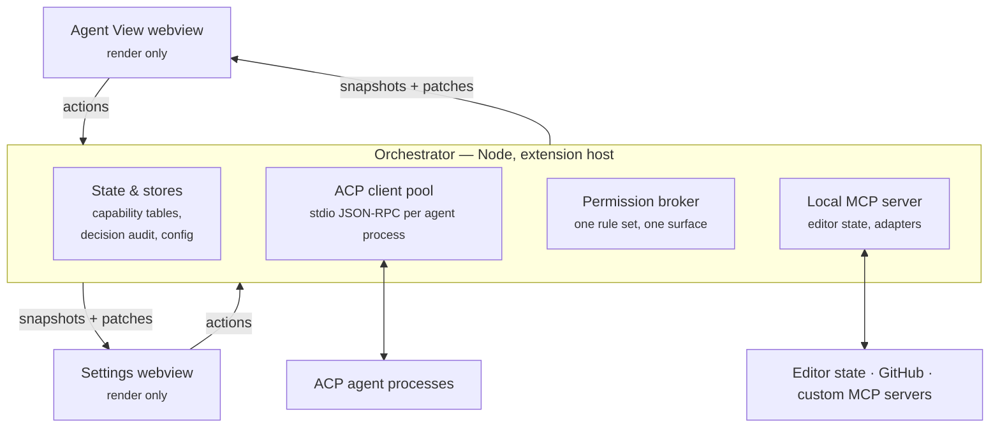
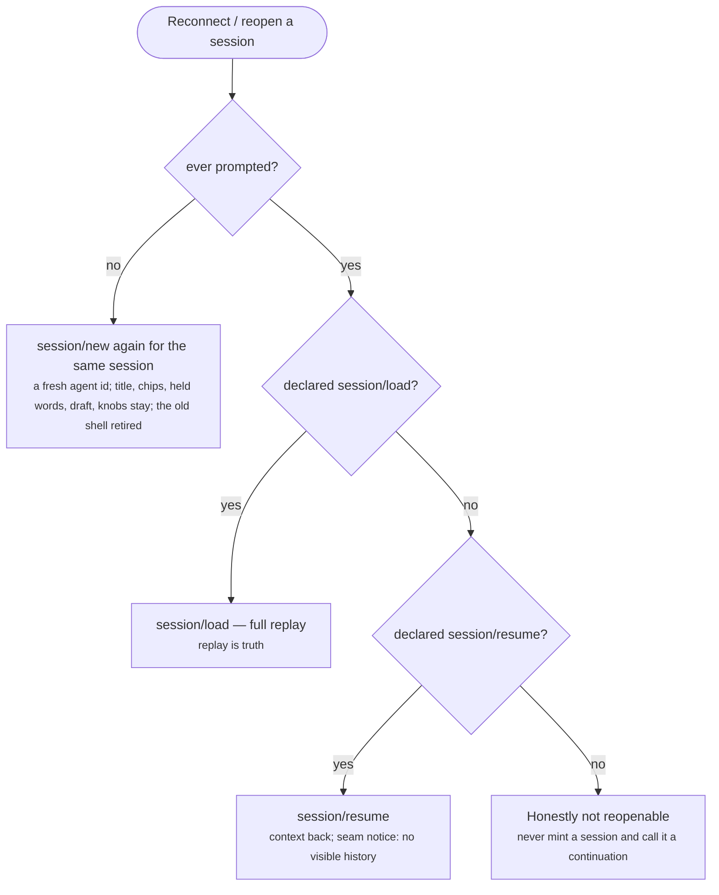
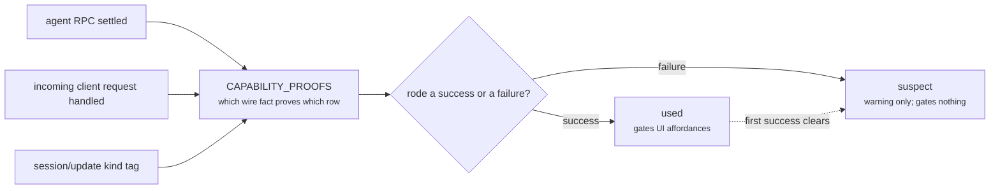
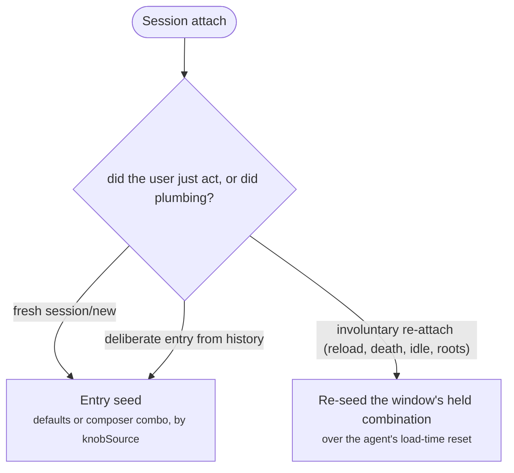
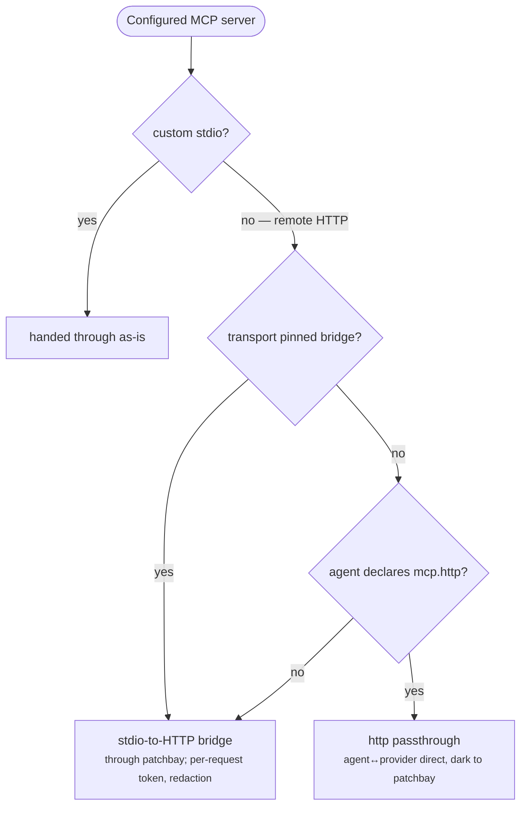

# acp-patchbay — Architecture

How the product surface becomes a VS Code extension. Inputs: [the PRD](prd.md)
(why) and [the Features doc](features.md) (what); on any conflict, they win. This
document decides mechanisms and records the reasoning. Stack is fixed by rule: TypeScript
for all extension-host code, esbuild, npm.

---

## Vocabulary

Terms are contracts — one meaning each, held everywhere (docs, code, UI copy):

- **Orchestrator** — the Node process in the extension host. Single source of truth
  for sessions, capability tables, permission rules, secrets, configuration.
- **Agent View** — the one blended webview: agents + sessions + chat. Not three panels.
- **Known sessions** — the sessions store's index of the sessions this
  window knows, repopulated from the agent's own `session/list` every
  connect: patchbay's id for each, its agent, and the agent's own id for it
  — its `sessionId` ([session ids](store-architecture.md#sessions)). Patchbay
  persists no session index: the durable continuity row is per-session
  state, never a list source. Nothing the view shows lives here — title,
  activity stamp, liveness, the unseen mark have one home, the Agent View's
  canonical row; the store reads such a fact through a hook when it needs
  one, never a copy.
- **Decision audit** — append-only record of events that happened *in patchbay*:
  permissions granted, tools approved, routing chosen.
- **Render cache** — disposable render state, rebuilt wholesale from `session/load`
  replay. Never merged, never reconciled.
- **Declared / used** — the two capability states: claimed at `initialize` vs.
  observed firing on the wire.
- **Brokered** — routed through the permission broker.
- **MCP server** — the *record*: a configured MCP-server connection (curated or
  custom) with its credential, env, routing, and active state — a row of the
  MCP-servers store (`McpServerConfig` stored, `McpServerView` on screen). Not
  the ACP SDK's `McpServer`, which is the *wire entry* an attach composes from
  a record into a session's `mcpServers` — two different things, told apart by
  their type names. Lifecycle is two-state: active/inactive (the mute switch — everything kept,
  nothing routed) and disconnect = full clear (credential + env + config; the
  catalog entry stays). One catalog entry can be connected more than once —
  two accounts, two servers, each with a minted id and a name of its own: the
  name rides the wire as the server's name, so no two servers share one, and
  it is given once, at the add, cut to the characters agents keep — they build
  tool ids and keep "always allow" rules under it, so it never changes.
  Nothing is stored until it can work — a cancelled OAuth consent adds
  nothing.
- **Fork** — the session menu's Fork, named for the protocol method
  `session/fork`: a new session the agent seeds with another's context (§ Fork).
  Only the agent's native fork; patchbay emulates none.
- **Routing** — the user's per-agent selection of which MCP servers that agent
  receives.

## Core principle

**ACP answers where the agent lives** — sessions, prompts, permissions, file
operations, terminal. **MCP answers what the agent reaches** — tools, resources,
context. Everything ACP doesn't model (live editor state, the user's MCP servers)
reaches the agent through `mcpServers` on `session/new` — chiefly a **local MCP
server the orchestrator owns**. This is the generic version of the pattern vendor extensions build
privately — it works for any ACP agent by construction, with zero per-vendor code.

## Architecture


```mermaid
flowchart TD
    AV["Agent View webview<br/><small>render only</small>"]
    SET["Settings webview<br/><small>render only</small>"]

    subgraph ORCH["Orchestrator — Node, extension host<br/><small>single source of truth</small>"]
        STATE["State & stores<br/><small>capability tables,<br/>decision audit, config</small>"]
        POOL["ACP client pool<br/><small>stdio JSON-RPC per agent process</small>"]
        BROKER["Permission broker<br/><small>one rule set, one surface</small>"]
        MCP["Local MCP server<br/><small>editor state, adapters</small>"]
    end

    AGENTS["ACP agent processes"]
    WORLD["Editor state · GitHub · custom MCP servers"]

    AV -- actions --> ORCH
    SET -- actions --> ORCH
    ORCH -- "snapshots + patches" --> AV
    ORCH -- "snapshots + patches" --> SET
    POOL <--> AGENTS
    MCP <--> WORLD
```

Data flows one way: webviews send **actions**; the orchestrator sends **snapshots and
patches**. No business logic, persistence, or protocol handling in webview code —
webviews are disposed when hidden and must rehydrate losslessly on every mount.

## UI layer

Two webviews and one near-empty native settings page:

1. **Agent View** — the single blend (the Features doc). Its layout is the owed
   design deliverable; what architecture fixes now is its information boundary: it knows
   only its current snapshot + patch stream, and can only emit actions. Anything the
   layout wants to show must arrive through that pipe — which is the whole
   rehydration guarantee.
2. **Settings** — agents and launch config, capability matrix, MCP servers,
   routing, permission rules. Structured data, low frequency, same render-only
   contract.
3. **VS Code native settings** — flat scalars only, deliberately near-empty.
   Never credentials: `settings.json` syncs.

Native surfaces — the status bar item (active session, connection health, usage),
the waiting-on-you and agent-update notifications, the Agent View's badge, and
command palette entries — are direct orchestrator consumers: same state, no webview in the path.

> Agents, sessions, and chat are one surface (the Features doc). Settings remains
> its own webview because it is genuinely a different activity, not because panels
> are cheap.

How both webviews are *built* — one shared component layer (shadcn/Radix on
React, Codicons, a single VS Code-theme bridge) and the chat transcript
rendering pipeline (Streamdown markdown, the ordered block model, tool-call
cards) — is decided in
[the UI Architecture doc](ui/ui-architecture.md); the split
above is about state and lifecycle, never visual identity.

### Snapshot + patch protocol

One protocol, one shared TypeScript module (`src/shared/protocol.ts`) both sides
import. No diffing library, no CRDT, no partial hydration:

- **Actions** (webview → orchestrator): a discriminated union — `sendPrompt`, `stopTurn`,
  `switchSession`, `resolvePermission`, `connectAgent`, … Fire-and-forget; results come
  back as state, never as replies.
- **Snapshot** (orchestrator → webview): the complete view model for that webview,
  tagged with a monotonic revision. Sent on mount and whenever the webview asks.
- **Patch** (orchestrator → webview): `{ rev, events[] }` — semantically named events
  (`agentUpserted`, `permissionRequested`, `permissionResolved`, …) applied by pure
  reducers in the webview. A webview that sees a revision gap discards its state and
  requests a fresh snapshot. Recovery is always "resnapshot," never "repair."
- **Coalescing**: the orchestrator buffers high-frequency `session/update` streaming
  chunks and flushes one patch per short fixed interval (~30 ms) or turn boundary,
  concatenating text chunks per message. One knob, no adaptive machinery.

One mechanism sized to the actual problem: webviews die and must resurrect
cheaply.

## State

The agent owns the conversation (features §1): patchbay persists no session
index and no transcript — the known sessions are repopulated from the agent's
own `session/list` every connect. Agents without `session/list` show only the
sessions open now; nothing of theirs survives a reload (deliberate scope
decision), and the Sessions drawer names each such agent so the gap is never
unexplained. Everything else patchbay holds — the stores, where each fact's
truth is, the queue and gates that order work on them, and where every saved
fact lives — is [the stores architecture](store-architecture.md).

## ACP client pool & process model

- Registry: `patchbayAgentId → { process, declared, used, sessions[] }`.
- Different agents are always separate subprocesses. An agent has **one
  process per window**, and every session opened with it rides that one
  connection — the protocol's own model (`session/new`/`load`/`close` are
  session-ID-scoped on one connection; a session's `cwd` applies wherever the
  process was spawned). Workspaces are separate already: each window runs its
  own pool. Accepted trade: an agent crash ends all of its sessions in the
  window; restart plus the attach ladder below brings them back. The
  `concurrentSessions` row is information only — the user's own second session
  (or a fork) proves it, a failed second `session/new` marks it suspect. An
  agent ever reproduced failing to hold two sessions gets a curated
  wire-extension entry; the default does not turn pessimistic again.
- Crash → visible immediately; restart is one action. After reconnect: the
  attach ladder — a never-prompted session is minted again on the agent's
  side (nothing agent-side to open; the agent hands it a fresh id, and the
  session stays itself, with what the user staged) >
  `session/load` (replay = truth) > `session/resume` (context back, seam
  notice: no visible history) > honestly not reopenable. Patchbay never
  mints a session and calls it a continuation — the zero-turn rung continues
  nothing, a new session knows it is new.


```mermaid
flowchart TD
    R(["Reconnect / reopen a session"]) --> Q0{"ever prompted?"}
    Q0 -- no --> Z["session/new again for the same session<br/><small>a fresh agent id; title, chips, held words, draft, knobs stay; the old shell retired</small>"]
    Q0 -- yes --> Q1{"declared session/load?"}
    Q1 -- yes --> L["session/load — full replay<br/><small>replay is truth</small>"]
    Q1 -- no --> Q2{"declared session/resume?"}
    Q2 -- yes --> RS["session/resume<br/><small>context back; seam notice: no visible history</small>"]
    Q2 -- no --> N["Honestly not reopenable<br/><small>never mint a session and call it a continuation</small>"]
```
- **Session lifecycle**: opening a session — drawer click, palette pick, or
  "Open in new window" — is one ceremony (`SessionGates.open`): the
  pointer moves unless the session is pinned to its own window, the ladder
  above runs, and an off agent is spawned (connect-on-demand); when an agent
  comes up, every session on view (active or pinned — the reaper's same
  exemption set) re-runs the ladder. The drawer's order is last activity,
  one fact with one home: the reducer's row stamp (`updatedAt`), moved by
  prompt send, turn end, and the wire's own stamp — newest wins, judged
  there and nowhere else; the sessions-store reports the evidence and
  keeps no copy. Cross-window freshness is a read, not a push: opening the
  drawer (or the palette's session pick) re-runs `session/list` on every
  running agent (`syncRunningAgents`), so another window's activity lands
  on the rows at the moment they are looked at — never polled. The Settings
  "active today" tile is a projection of the same rows (`session-stats.ts`),
  republished from the channel's change hook like the status bar. Switching
  chats never closes anything. The idle
  reaper alone closes a session that stays — the session menu's Close is for
  agents without `session/list`, where the session leaves — and only when
  *all* hold: not new
  (`everPrompted` — a never-prompted session never closes, period; agents
  404 load/resume on zero-turn ids), nothing in flight, not unseen-completed
  (blue mark), prompt box empty (structural: the composer exists only for
  the active session, which is always exempt), idle past the auto-close time
  (a user setting, default 60 min, zero disables), and declared `session/close`
  plus `session/load` — never resume: patchbay persists no transcripts, so closing anything
  less than fully-replayable would destroy the only copy. "New session" for
  an agent with a never-prompted session focuses it instead of minting a
  sibling — a row fact (`everPrompted` on the known row, with `titled`), so
  it holds after an involuntary drop too: the dead row is still the new
  session, and its next use by any door (new-session focus, drawer click,
  a prompt) re-mints it. A second ask while the first new session is still
  on the wire gets that same session.
- **Launcher health** (launcher-health.ts — one central module, used by
  every launch of a launcher package, an agent's connect and an MCP
  server's probe alike, never inlined): npx/uvx stay the installers — a
  patchbay-owned install store was **considered and rejected** (it fixes
  cache corruption by owning atomicity, but the price is reimplementing the
  package manager's lifecycle: GC with in-use guards, single-flight,
  stale-fallback policy, bin resolution; the price exceeds the defect).
  Instead: (a) **the package is made ready before it runs, judged by state,
  never by how a launch died.** npm never rolls back a killed install, and
  every npm reads the half-written `_npx` entry as installed — npm 10 then
  dies on a bin that was never linked, npm ≥ 11.2 on the entry's missing
  package.json. So before each launch the entry npm itself would use (its
  own naming: sha512 of the package spec) is read by the marker arborist
  writes after everything else an install does, the hidden lockfile
  `node_modules/.package-lock.json` — present whatever the user's npm
  config. An entry without it is removed; one whose npm `concurrency.lock`
  is held is waited out the way npm waits (released, or stale by npm's own
  one-minute rule). **A finished entry can still be short:** npm skips any
  optional package whose install fails, whatever failed it (a download cut
  mid-stream — fetched once, never retried, never resumed — or a scanner
  holding the file), logs it at verbose level only, exits 0, writes the
  marker, and no later `npx` fetches it again; an agent shipping its
  platform binary as an optional package then fails at its first session
  (the field case: claude-agent-acp on a 4G link that drops). So a finished
  entry is also read against what npm meant it to hold
  (`droppedOptionals`): each installed package's declared optional
  dependencies (the hidden lockfile) that resolve to nothing on disk,
  judged by npm's own platform rule (`npm-install-checks`) against the
  platform npm installs for — its own node's, asked of the node the
  launch's env finds, since it is not always the editor's (an x64 node
  under Rosetta or on Windows ARM) — on each one's
  platform facts — from the full `package-lock.json` npm writes beside the
  install, or from npm's cache (`npm view <spec> --json --offline`) where
  that lacks them (`package-lock=false` writes none; npm 10 omits `libc`,
  which only Linux reads). What neither can describe stays unjudged. A
  short entry is removed like an unfinished one; npm's cache keeps every
  package that did land, so reinstalling fetches only what's missing. Then
  the registry-shaped package is installed as a labeled phase
  (`npx -y --package <pkg> node --version`), run to its exit, and an
  install that doesn't complete — the launcher fails, or npm finishes
  short — is healed and tried again, three times, the retry named in the
  same label; there is no clock between tries (a link that is down fails
  npm's own request retries, which wait). The last failure fails the
  connect: in the launcher's own words, shown in the card's output tail,
  or naming the packages npm left out, with the likely cause (an unstable
  connection) said as likely. **No clock bounds a download or a launch** — a
  slow link is a working one, and cutting the install is exactly what
  poisons the cache (the field case: a 112 MB Windows package on a slow
  link, cut by limits patchbay used to set). `initialize` waits for the
  agent's answer or its exit; an agent that writes something other than
  ACP before answering is named on its card (most likely a CLI asking for
  first-run setup); Stop ends any of these waits. (b) The binary installer, where
  patchbay *does* own the disk, prevents rather than repairs: staging dir +
  rename-on-success, so nothing ever exists at the installed-check path
  unless the whole install succeeded. (c) **Two installs, one memory**: a
  PATH-installed sibling CLI shares the agent's per-user state store with
  the copy patchbay runs (by design — never a second history); a
  major-version divergence between the two writers gets a one-time warning,
  never a gate. The comparison is like-with-like via a table keyed by
  registry id (`PATH_SIBLINGS`): the bundled CLI's version, not the adapter's — entries
  earned by verifying that mapping (claude-acp absent: its adapter bundles
  the SDK, no honest comparison exists). Patchbay never mutates PATH or
  installs globally — a user who wants the CLI in their terminal owns that
  install and its update channel.
- **Launch prerequisites** (runtime-resolver.ts, the pool's one launch-phase
  seam, ahead of warmup and spawn alike — every download an agent needs
  happens here, as a labeled phase on the agent's own card, behind one modal
  confirmation, never as part of adding it). A registry `binary` agent's
  archive is the first prerequisite: the config persists at the click with
  the archive facts, and the connect resolves `command` to the cached path,
  downloading when this version isn't cached — always confirmed first, and
  held to the archive's SHA-256 when its registry entry publishes one
  (optional per target in the registry format). The digest is pinned with
  the version at Add and replaced whole at Upgrade, because the registry
  lists only each agent's latest version. The registry is read right before
  the download; its word wins while it still lists that version, the pinned
  copy after it moves on — and the prompt says only what is known: checked,
  none published, or the registry couldn't be read. It is checked on the downloaded bytes before anything
  touches disk. A malformed digest refuses before the prompt; a mismatch
  re-reads the registry and downloads once more; a second mismatch fails
  the connect naming both digests — no run-anyway (a user who wants those
  bytes regardless adds them as a custom command). No digest: the prompt
  says the download can't be checked. A cached binary is never re-judged:
  what the cache holds passed the check on its way in. Then **runtime
  resolution**: an `npx` agent needs Node.js, a
  `uvx` agent needs uv (which provisions its own Python) — neither is
  guaranteed on the machine, and Windows is where the gap bites.
  **Detect-first, sandbox-fallback**, decided over always-sandboxing (Zed
  manages its own Node unconditionally): a working system runtime *is*
  reality, and shadowing it would fork behavior from the user's terminal.
  The gate is a real `--version` round-trip through the same spawn rules as
  the launch (presence on PATH proves nothing — the declared≠used instinct
  applied to interpreters), plus a version floor for node; re-run fresh
  every connect, never persisted, and waited on until the program answers
  (a first-touch node.exe under a virus scan is slow, not missing — reading
  it as missing would download a runtime over a working one). Only a failed
  gate downloads a
  pin-versioned runtime (curated catalog: nodejs.org / uv release CDN) into
  the same bin-cache as binary agents — same staging+rename integrity, same
  explicit-confirmation-before-download ethos, and held to its publisher's
  SHA-256, pinned in the catalog beside the version (keyed by archive name,
  so a version bump without new digests fails the catalog's test; the same
  check and one retry as agent binaries, no run-anyway), then re-gated itself before
  use (a glibc build on musl fails the connect with a real reason). The
  applied decision is PATH-prepending into that one agent's spawn env —
  the command is never rewritten, so every downstream spelling (warmup,
  Windows .cmd shim handling, the cache check) works unchanged, and nothing
  is installed system-wide. Deliberate pairing with the data stance:
  **runtime = ours when needed, state = always the agent's own** — the
  managed runtime changes which interpreter runs, never where the agent
  keeps sessions, auth, or config, so terminal and patchbay copies stay
  one history.
- **Agent updates** — one fact, worked out where it is read
  (agent-updates.ts): a registry config whose pinned version trails the
  registry's, unless the running agent already reported the registry's
  version (the wire outranks the pin). Never stored: it rides each agent's
  row, re-sent whenever a registry read or a config write moves it; the
  Settings card, the Agent View's agent chip and the notice all read it,
  none derives it. A
  registry read landing (never the cached copy loaded at start) announces
  each newer version once per window. Upgrade is always the user's click, through the one upgrade
  path: it reads the registry and re-resolves the version like a first
  add — before anything stops, so a registry that no longer lists the agent leaves it
  running — and asks before a stop that would disconnect open
  conversations.
- **Agent operations take turns** — one line per agent, a repeat joining,
  Stop and Remove cutting in, and one question before a connection ends:
  [the stores architecture](store-architecture.md#agents).
- **Session operations take turns too** — two lines per session, each
  session's work behind its agent's, Stop, Reload, Delete and Close ending a
  turn:
  [the stores architecture](store-architecture.md#sessions).

## Message readers

The pool is the one place an agent's messages enter. What a message *means*
is owned by one reader per ACP message type (`src/orchestrator/readers/`),
run at the pool's chokepoint where the message arrives; what leaves the pool
is the reader's fact, never the raw wire object. The SDK validates the
agent's notifications and requests; a response arrives exactly as the agent
shaped it, so its reader checks what it takes — identity is structural (a
`session/new` without a sessionId fails its call), everything else degrades
to absent, noted. A capability is declared only in its own shape (an object,
or true), and an agent's malformed name never costs its version.

- **One rule.** An absent field is unchanged — never a default — except where
  the spec names one (an announced tool call is pending, of kind other, until
  it says otherwise). A field patchbay renders is rendered; one nothing
  renders yet rides the fact, so a surface can take it up without going back
  to the wire; a vendor's field stays in `_meta`, read by its extension
  module.
- **One message type, one reader.** Every consumer of a type reads the same
  fact: a tool call is read once, for the session's stream and for a
  permission request alike.
- **Nothing dropped without a word.** Every `session/update` kind has one
  fate, decided at compile time: read into a fact, or *carried* — shown in
  the transcript as the agent sent it, its kind on a dim line and its payload
  a click away, until a surface of its own is decided. What a reader can't
  take — a kind with no surface, a value it ignores, an update for a session
  not open here — is a note in the Output channel, said once per agent,
  place and note: the one way a user sees it without the wire log.

Every message is read this way: `session/update` (content, tool calls,
plans, commands, usage, title, knobs); the agent's own requests
(`session/request_permission`, files, terminals, elicitation); and the
answers to every request patchbay sends (`initialize`, the session
lifecycle, `session/list`, `session/prompt`, `session/set_config_option`) —
a session response's knobs through the one normalizer with the extension
doors, where the raw response is read. An agent's error is thrown, not
handed over, so it is read where it is caught, by the one error reader: its
message and what its `data` adds (where agents put the reason), and whether
it bears on auth. A failure the user caused — a turn, a log-in, a knob
change, a fork — says it where they are, in those words; a background one
says it in the Output channel.

- **The boundary is held by the compiler.** A hook's parameter carries its
  type with no import, so an import ban can't hold the line. A test does
  (`test/wire-boundary.test.ts`): every property read in `src/` whose
  property the protocol's schema declares must sit in the reader layer — the
  pool, the readers, the extension modules, the `_meta` table. Building a
  message to send is not reading one; the two files that read back only
  what patchbay itself built are named in the test, each with why.
- **Rendering is pinned.** A wire corpus (`test/wire-corpus.test.ts`) runs
  the whole `session/update` surface through the real wire, live and as a
  reload's replay, against golden files: a change to what any agent message
  renders as is a reviewed diff of the goldens.

## Agent capability matrix

Two states per capability, per agent — **declared** (from `initialize`, refreshed
every connect) and **used** (set only after the path actually fires on the wire —
whether that's real usage or patchbay's own free connectivity probe; "used" over
"verified" because a single success proves the path fired, not that it's
certified correct). Used is **version-keyed**, not connect-keyed
(`stores/used-capabilities.ts`): a reconnect at the *same* `agentInfo.version`
restores what was already proven immediately, from the persisted cache — it does
not re-run the check. Only an actual version change earns a fresh,
honestly-unused matrix. The matrix is a view of what was collected about an
agent, and decides nothing: every feature follows what the agent declares.
What it shows is worth seeing because real bridges have been observed
silently dropping `mcpServers`, collapsing stop reasons, and reporting
rejected mode changes as succeeded.
Four honest states per row: not declared / declared-but-not-used / used /
**suspect** — declared, not used, and implicated in at least one failed
request (a wire fact that would have proven the row rode a request that
rejected). Suspicion, not conviction: the failure may not be the row's fault,
so it renders as a warning triangle, never an error, and gates nothing.
First success acquits (used drops the
flag); `auth_required` never indicts (it's the honest pre-login state, with
its own surface: pool.ts's wire chokepoint raises `needsAuth` on any -32000 —
probe, connect, or a mid-session prompt after credentials expired — one
writer for the spec's "prompt the user to authenticate again"); only
outgoing agent RPCs can indict — a client-side handler
throwing is patchbay's own gate rejecting, never the agent failing — and a
call cut off by its connection's own stop indicts nothing either: patchbay
ended it, the agent didn't fail it. Suspect
persists version-keyed exactly like used: a broken bridge must not look clean
after a restart.

Marking a row used is centralized in one **proof table**
(`CAPABILITY_PROOFS`, capabilities.ts) — the single place that knows which wire
fact proves which row. `pool.ts` — the sole channel that talks to an agent on
the wire — consults it at three chokepoints: an outgoing agent RPC resolving
(`session/new` → `auth`, and → `concurrentSessions` when the connection already
served a session; `logout` → `auth.logout` — declared from
`agentCapabilities.auth.logout`, and the Log out control only exists on a
declared row: the spec's "Clients MUST NOT call it" holds by construction;
`session/fork` → `session.fork` + `concurrentSessions`;
`session/load` → `session.load`; `session/prompt` → `prompt.image` / `audio` /
`embeddedContext` when the prompt actually carried that block type), an
incoming client request handled (`fs/read_text_file`, `fs/write_text_file`,
`terminal/create`, `elicitation/create`), and a `session/update` kind tag arriving (`usage_update` → `usage`).
The same table serves both verdicts: a fact riding a successful call marks its
rows used; the same fact riding a failed call marks them suspect. For an
incoming client request, success means patchbay answered: a deliberate refusal
(a rejected write or command, a missing file) is the path working and marks
used, a fault marks nothing, and suspect is never raised — the failing side
is patchbay, not the agent. No call site
anywhere names a row; adding a `CapabilityRowId` forces a table entry (the
Record is exhaustive) and nothing else. One `onCapabilityEvidence` hook
carries every hit, called synchronously and never awaited so it can't block
the RPC it's reporting on. `capability-tracker.ts` only decides *when* to run
the synthetic probe below and persists whatever pool.ts reports — it does not
mark anything itself. session-stream.ts, which turns `session/update` facts into
the transcript, marks nothing either; the wire-level fact and the render-level
interpretation are two different concerns living at two different layers.


```mermaid
flowchart LR
    C1["agent RPC settled"] --> PT
    C2["incoming client request handled"] --> PT
    C3["session/update kind tag"] --> PT
    PT["CAPABILITY_PROOFS<br/><small>which wire fact proves which row</small>"] --> H{"rode a success or a failure?"}
    H -- success --> U["used<br/><small>gates UI affordances</small>"]
    H -- failure --> S["suspect<br/><small>warning only; gates nothing</small>"]
    U -. "first success clears" .-> S
```

Rows (`CapabilityRowId`, protocol.ts) are **hand-picked** against the ACP spec's
declared capability surface, not derived automatically: `fs.readTextFile` /
`writeTextFile`, `terminal`, `elicitation`, `resources.subscribe`,
`promptCapabilities.image` / `audio` / `embeddedContext`, `session.fork` /
`load` / `resume` / `additionalDirectories`, `mcp.http` / `sse`, usage/context reporting,
concurrent-session behavior. A new ACP capability needs a row added here before it can show up
at all — a deliberate scope decision (ACP's capability surface is still
settling, and rows need human-curated meaning and a check strategy anyway, so a
schema-driven dynamic list wouldn't remove the manual step), not a limitation.

Verification cost splits the triggers:

| Trigger | Protocol-level (free RPC) | Behavior-level (costs real LLM turns) |
|---|---|---|
| Connect/reconnect: `session/new`, then its `session/close` where declared | Automatic | Opportunistic only — used when naturally exercised |
| Background schedule | Fine, cheap | Never |

Connect therefore always implies one throwaway probe session — an accepted
behavioral contract, not an accident: `session/new` is free, and the close
proof falls out of the same round-trip; a close that fails fails nothing
else. Fork and delete are not tried: a never-prompted session is no fair
subject for either (Claude's adapter knows a session only after its first
message), so real use proves them, like every other row. (The Settings defaults editor opens its own throwaway
session on the same standing probe directory — see § Session model — but
only while a card's knob editor is expanded, never at connect.) (Auth proof deliberately does
NOT — see § Auth evidence below: `session/new` succeeding is non-bearing on
lazy-auth agents.) The probe session's root is the
agent's **standing probe workspace** (`globalStorage/probe/<patchbayAgentId>` — never
the user's workspace roots), created idempotently per probe and deleted only
with the agent's config: a workspace-aware agent may validate or index that
root *after* replying to `session/new` (observed: Auggie, where a vanished
root is CLI-fatal), so the root's lifetime must cover the agent's use of it,
not patchbay's RPCs — an ephemeral per-probe temp dir was a promise patchbay
deleted while the other process still held it.

Synthetic behavior probes run in an **ephemeral session scoped to a temp directory**
— never the user's workspace roots, never silently.

### Auth evidence — the same discipline, applied to a two-state fact

`needsAuth` is the capability matrix's sibling problem: a fact with multiple
would-be writers where the wire offers no query to re-read the truth. The
answer is the same shape — an authority table (`auth-evidence.ts`, the auth
sibling of `CAPABILITY_PROOFS`) that alone decides which evidence may move
the locked/unlocked state, consulted by one writer (the agents store's
`noteAuthEvidence`, agents-store.ts); no call site anywhere decides what a
wire fact means for auth.

- **Locks** carry their provenance: a wire `auth_required` records the method
  that raised it; a successful `logout` round-trip is itself the strongest
  lock (the user's witnessed action, never a clear).
- **Clears** require bearing evidence: an `authenticate` success, a terminal
  login exiting 0, or a completed prompt (the one wire fact even a lazy-auth
  agent cannot produce while logged out) clear any lock; any other method's
  success clears only a lock that same method raised (a strict agent's
  `session/new` failure is honestly contradicted by a later `session/new`
  success). A bare connect, and a lazy-auth agent's `session/new` passing,
  bear nothing — the transitions that used to launder a logout. And a
  success bears only on a lock older than its call: evidence is earned when
  the RPC leaves, so a prompt that left on valid credentials and finished
  after the lock was raised — a sibling session's `auth_required`, a
  witnessed logout — contradicts nothing. Every lock carries its `at`;
  every success carries when it started; the table orders the two.
- **Locks persist** (machine store, `stores/auth-locks.ts`): reload +
  autoConnect cannot launder a witnessed logout. Not a cache of readable
  reality — the wire has no auth query; the witnessed event is the only
  record there is. Cleared with the agent's config, wiped by erase-all.
- The matrix `auth` row is proven only by the affirmative auth actions: an
  `authenticate` round-trip (declared methods only) or a terminal login
  exiting 0. Other clears — a completed prompt, a same-method contradiction
  — honestly end the lock without marking the row: clearing ≠ proving, and
  a transient -32000 healing itself must not fabricate a proof. Never by
  `session/new` succeeding.
- One thing the writer refuses on its own: evidence for an agent whose
  config no longer exists (a terminal login left open across a Remove).
- **A standing lock is a turn-start precondition** — the consumer side of
  the authority. The one adjudication every prompt passes (the session
  gates' `prompt`, ahead of any transcript write or wire call; the drain
  re-checks the same conditions before taking the next words) treats a
  lock as a running turn's peer: the words queue as visible held rows —
  never a fabricated user message fired into a wire already witnessed to
  refuse, never a silent drop. A turn releases them when it ends; the lock
  when its clearing drains the held words (`lockCleared`, poked by the one
  writer). The idle reaper spares sessions holding words. The composer's
  disabled state is the courtesy telling the user why; the door holds the
  words, and the store's turn refuses to start under a lock whatever
  reaches it — the invariant at the writer.

The generalized rule (state-authority, `.dotagent/rules/`): centralized
transport is not centralized authority — every fact with more than one
writer gets its transition rules declared as data at one site, and callers
report what they witnessed, never conclusions.

## Wire log — the opt-in raw-frame tap

Settings › Audit can stream every ACP JSON-RPC frame (the stdio ndjson wire —
there is no gRPC anywhere in this stack) to a dedicated Output channel.
Decisions, recorded:

- **Redaction at the seam, not consent alone.** `session/new`'s `mcpServers`
  array carries the env values patchbay injected for custom-stdio servers —
  real secrets on the wire. Every value patchbay reads out of SecretStorage on
  its way to a session is registered with the wire log and masked before a
  byte reaches the channel (`wire-log.ts`); over-redaction of plumbing values
  is accepted as the safe direction. What an agent echoes back on its own
  initiative cannot be masked — the disclosure prompt says so instead of
  pretending otherwise.
- **Never persisted; TTL-bounded.** Debugging is a session act, not
  configuration: a reload always starts clean, and the log turns itself off
  after 30 minutes unless deliberately extended. While on, a warning-tinted
  status-bar pill shows the countdown; its existence *is* the state. Click →
  stop (fast path) or extend.
- **Tap lives in pool.ts** — the sole channel on the wire — line-assembled so
  redaction always sees whole frames, and zero-cost while off (chunks dropped
  before decode). Frames over 8 KB are truncated with an honest marker.
- **Non-protocol output is named, never shown, outside the log.** An agent
  that writes lines to its protocol channel that aren't messages (a banner,
  a debug print) gets one line in the Patchbay log per connection — the
  agent's name, never the content, which may carry anything — pointing at
  the wire log for the full case. The SDK answers each such line with a
  JSON-RPC parse error and the session goes on. So the incoming direction is
  always line-assembled until that note fires; the check is the line's first
  character (a message opens a JSON object or array), so malformed JSON that
  opens one is left to the wire log.

## Protocol extensions (`_meta`)

ACP reserves `_meta` fields on every type and underscore-prefixed methods for
implementation extensions — a spec-sanctioned mechanism, not a dialect. Adapters
carry real surface there beyond core protocol; observed in `claude-agent-acp`:
`_claude/sdkMessage` (tunnel of the raw Claude Agent SDK stream),
`_claude/rateLimit` (subscription rate-limit windows), `_claude/askUserQuestionOption`
(richer permission options), and a terminal-output `_meta` channel shared as a
convention with `codex-acp` for live command output — adopted consume-only for
the delta channel codex-acp sends unasked, the only place its command output
rides. The observed pattern:
extensions enrich standard updates in place — `_claude/rateLimit` rides the
standard `usage_update` notification's `_meta` while `used`/`size` stay
protocol-shaped — they don't fork the stream. Token and context reporting is
standard; only the vendor-specific remainder is extension.

Stance: **core ACP is the floor; extensions are per-agent adapter knowledge**,
recorded in code tables (meta.ts) and consumed only when a features bullet requires what
core ACP cannot carry. A consumed extension becomes a capability row — present by
observation, used like everything else. Vendor depth that never reaches the
wire (hooks, subagent definitions, skills, rules, commands) is files in `cwd`
the agent reads itself — patchbay has no surface for them and no protocol is
involved (§ Rules, skills, commands).

### Wire-extension modules

The spec-pure-core rule, generalizing meta.ts's discipline from the `_meta`
site to every out-of-spec adoption (extra response fields, undeclared
methods, removed-draft surfaces, behavioral quirk workarounds):

- **Core stays spec-pure.** No core file (pool, sessions-store,
  session-stream, knobs, capability-tracker, orchestrator) may contain a deviation's shape, wire
  method name, or display policy — and never a vendor name; adoption is
  always shape-gated, like everything else in patchbay.
- **One deviation = one module** under `orchestrator/extensions/`, owning:
  the zod schema (trust boundary, degrade-to-absent), the method string,
  the policy decisions the quirk forces, the adoption date, and a **retire
  condition** in its header. Retirement is mechanical: delete the module
  and its one compose line.
- **Core exposes declared doors, not interception points:**
  `pool.unstableRequest(patchbayAgentId, method, params)` — the one untracked
  escape hatch (extension-owned methods bear on no capability row);
  `normalizeKnobs(..., extras?)` where an extra is `{ knob, execute }` —
  knobs.ts applies one generic rule (extras append unless a spec-surface
  knob owns the id) and knows nothing of any shape; `performKnobSet`
  (knobs.ts) runs extension routes through one generic branch forever (the
  route executes itself and returns the next state to publish, or null to
  wait for a notification) — the one place a routed set meets the wire,
  shared by the user set, seeding, and the defaults editor; the session
  response readers hand the raw response to the extension doors at the one
  place it is read, so a new surface never ripples a hook signature; the
  session stream passes an agent's prose through `createProseRewriter` and
  its tool-call facts through `createToolCallRewriter` — opaque filters that
  may hold something back, and are flushed (prose, at the run's close) or
  released (tool calls, at the turn-end sweep) so nothing held vanishes.
- **Shape-gated wherever shape exists; id-keyed only where it can't.** A
  silent behavioral quirk (nothing on the wire announces it before it bites
  — e.g. Auggie's first-session mcpServers latch) cannot be shape-gated, so
  its extension module carries an id-keyed curated entry, the
  META_EXTENSIONS discipline: earned by reproduction, version-stamped,
  dated. Core still never names the vendor — the id lives in the module.
- **Deliberately NOT a hook/plugin framework.** Function-extension systems
  (Odoo-style inheritance, hook buses) earn their complexity from third-party
  module ecosystems; patchbay's deviations are first-party and curated —
  the `_meta` table (meta.ts) plus the modules in `orchestrator/extensions/`
  (removed-draft models surface, first-session mcpServers latch, render
  directive rewriter, turn-time auth failure code, to-do list read as the
  plan at this writing).
  Retirement is the same mechanism in reverse: the typed auth-method module
  left when its RFD landed in the published schema — its parse moved into
  core (capabilities.ts), where the spec's own surface belongs. Free interception
  would dissolve the one-door discipline (knobs.ts, CAPABILITY_PROOFS) that
  this codebase is built on. None of them demand shared machinery yet — each
  composes by hand-named export through `extensions/index.ts`; a registry
  earns itself when they do — extension point visible, not filled
  prematurely.

The pilot is Auggie's removed-draft models surface (the Auggie dossier),
refactored into `extensions/session-models-field.ts` — precisely the shape this
rule exists to keep out of core files.

## Fork

**The agent's native fork, nothing emulated.** The session menu offers Fork
where the agent declares `session/fork` (`src/shared/session-offers.ts`). The
fork runs on the original's attachment line, behind its agent's work: a
running turn is waited for, never ended, and the original attaches first, so
its agent holds the context it forks. The new session rides the one attach
chokepoint like any other (its own token, MCP servers, the original's roots),
takes a title naming the original until its agent names it, and opens. No
list or session info carries a fork's original, so the link is a saved fact
of the fork's own (its original's agent id), named to the original's row
again after every list read; the session row shows it as "Forked from
‹original›". Its
earlier messages are the agent's to show: where the agent declares
`session/load` the fork is read back from it; where it can't, the fork says
so. Patchbay copies no transcript — an emulated branch would be a cache
presented as a conversation. `session/fork` takes no point to fork at, so
forking at an earlier turn, and editing a sent prompt to fork from there,
wait for ACP to name points in a session (the session-cursor and rewind
proposals).

## Session model, mode, effort

Knobs (model, mode, effort, thinking, …), each existing only if the agent offers
it — model is the only one observed everywhere; the rest are frequent but
optional. The knob set is per-agent reality, not a patchbay form to fill.

**One knob processor.** `knobs.ts` is the knob sibling of `capabilities.ts`: the
only module that reads the wire's modes/configOptions relationship. Every
knob-bearing wire fact (create/load/fork responses, `config_option_update`,
`current_mode_update`, set responses) passes through it and comes out as one
normalized knob list; every knob set goes back through it to be routed
(`session/set_config_option`, or `session/set_mode` on the fallback surface).
No other file — and no webview — may distinguish the two surfaces
(render-only-webview: the UI renders knobs and sends `setSessionKnob`, nothing
else).

- **Exclusivity, per spec**: ACP v1 declares config options the successor —
  clients "SHOULD use `configOptions` exclusively and ignore `modes`", and v2
  drops `session/set_mode` entirely. So any non-empty `configOptions` wins the
  whole surface; `modes` alone synthesizes a single fallback knob
  (`MODE_KNOB_ID`). Category is UX-only ("MUST NOT be required for
  correctness"), so it is never a dedup key; under exclusivity the dup-pill
  class of bug is unrepresentable.
- **`current_mode_update` on the config surface is dropped** (visible in the
  wire log, never guessed at): mapping it onto an option would need category as
  a correctness key. The spec's transition duty ("keep both in sync") means a
  config-surface agent confirms mode changes via `config_option_update`; a
  bridge that doesn't earns a quirk entry in knobs.ts — the designated place —
  never a standing heuristic at a UI leaf.
- **Selections are knob-id-keyed everywhere** (defaults, confirmed
  combinations): one flat record, the modes-fallback knob under `MODE_KNOB_ID`.
  An agent's defaults saved before that, with a `mode` field of its own, are
  rewritten under `MODE_KNOB_ID` once, when the config store is built.

**Offerings are read, never stored; selections are stored, never inferred.**
ACP has no session-independent "list the knobs" call — `initialize` carries
capabilities only; the option surface rides `session/new`/`load`/`fork`
*responses* and `session/update` notifications, deliberately per-session state.
And offerings are provider inventory, not build behavior: a provider adds or
removes a model without `agentInfo.version` moving, so no persisted copy can be
keyed honestly. Therefore:

- **Offerings** are read by the Settings defaults editor from its own
  throwaway session, for the defaults being edited. A surface is conditioned on
  its selections — OpenCode offers `effort` only for models with variants, with
  values per model; effort lists vary per model on Claude too — so a surface
  read at agent defaults cannot show the knobs a saved default reveals, and no
  cached union could state their values (option lists come from remote
  providers and move without the agent's version moving). The editor
  (`defaults-editor.ts`) therefore opens one session per expanded card on the
  standing probe directory (no MCP servers, never an LLM turn), seeds it with
  the stored defaults to a fixed point, publishes the surface the agent answers
  with, re-reads after every edit (`set_config_option` is a free read), and
  ends the session on collapse, panel close, or disconnect. The session
  holds no truth — the store does — so a dead or stale one is thrown away and
  recomputed, never reconciled. Live sessions never feed the form: their
  surfaces track whichever session last touched a knob. Settings renders
  offerings only while the agent is connected; stopped agents show stored
  selections as text. A latched agent (first-session MCP latch) states that
  its defaults open after its first real session rather than spending the
  latch on the editor.
- **Seeds apply to a fixed point** (`applySeedToFixedPoint`, knobs.ts): an
  entry the surface doesn't offer yet may be revealed by an earlier entry's
  set, so passes repeat until a pass lands nothing — `{effort, model}` lands
  regardless of key order, for the editor's session and real sessions alike.
- **Selections** (per-agent defaults, part of the agent's config record; and
  per-session confirmed state, below) are the only persisted artifacts — bare
  ids/values, never lists.
- Patchbay never invents entries, never renders a knob the agent didn't offer.
- Displayed values update only from the agent's subsequent state notifications,
  never from the set-request's success response — bridges have returned success
  for rejected mode changes. What the user sees is the last agent-confirmed
  state, which is the honest one.

**Two knob holders, one seeding rule.** A knob combination lives in exactly
two places, and every attach decides between them by one question — *did the
user just do something, or did plumbing?*

- **Session knobs** — the session's own agent-confirmed combination,
  saved per publish on the session's continuity row (below), its one
  home. An **involuntary re-attach** — window reload, connection death,
  idle release, the roots re-apply — must re-seed it after the wire attach:
  agents reset knob state to their defaults on `session/load` (observed:
  claude-agent-acp rebuilds session config), and the user asked to change
  nothing — so honoring the agent's load-time reset would force its
  cache-miss over the user's reality. A restored window is in this arm: the
  row is read again when `session/list` names the session (the first
  persisted copy of this fact was lost with the removed session index — its
  rationale was orphaned by that pivot, not superseded).
- **Composer knobs** — the user's current working combination *per agent*
  (`stores/composer-knobs.ts`, machine store), written only when the user sets
  a knob and the agent confirms it (config surface: off the set response;
  modes surface: off the agent's own `current_mode_update` — set responses
  are never trusted). Never written at attach time — that would make "last
  used" mean "last attached", overwriting the record with agent defaults
  whenever an old session opens.

**Seeding at session birth/attach** — one policy (`reseedAfterAttach`):

| Attach | Seed applied |
|---|---|
| Fresh `session/new` | Entry seed: per-agent defaults, or the composer combination, by the `knobSource` preference — once, via set requests, skipped silently where the option isn't offered |
| Involuntary re-attach (window reload, connection death, idle release, roots re-apply) — the session's combination is in hand (its continuity row) | The session's own combination, re-seeded over the agent's load-time reset |
| Deliberate entry from history — nothing in hand (never steered, or its durable row already pruned) | Entry seed, same as fresh. This knowingly overrides an agent that honestly restores per-session knob state on load: entry is deliberate, the user's current combination wins |


```mermaid
flowchart TD
    A(["Session attach"]) --> Q{"did the user just act, or did plumbing?"}
    Q -- "fresh session/new" --> E["Entry seed<br/><small>defaults or composer combo, by knobSource</small>"]
    Q -- "deliberate entry from history" --> E
    Q -- "involuntary re-attach (reload, death, idle, roots)" --> W["Re-seed the window's held combination<br/><small>over the agent's load-time reset</small>"]
```

Per-agent defaults themselves are written only by the Settings save path —
read-only to the session layer, the seed's fallback, never its record.

**Session continuity — what the user staged and steered.** One durable row
per session (`stores/session-continuity.ts`, machine store) carries
everything the wire cannot report again: the
agent-confirmed **knob combination** (agents reset knobs on load), user-added
**context roots** (the list this client intends to send at the next open —
every open re-sends the whole list, so losing it would overwrite the
agent's own copy; a `session/list` row that reports the session's roots
replaces it, see the roots bullet under the local MCP server), the **held
prompt queue**, prepared **context chips**
(an image's or a dropped file's bytes live in the session's own folder, the
row carrying the path, and a chip whose file is gone drops honestly on
rehydration — see [where saved facts live](store-architecture.md#where-saved-facts-live)),
and the **composer draft**. Not a cache of readable
reality — the same justification as the auth locks. The row is these facts'
one home, in the window as across a reload: the sessions store reads it
whenever it needs one (`saved`) and keeps no copy, and every change writes
it field by field before the view hears of it — so every session has one,
whatever its agent declares, and a chip staged while its session is
detached waits there for the next prompt. When `session/list` names a
session the window didn't know, the row's roots, held words and draft go
to the view at once and its chips once their image bytes are read back
from the session's folder. Each row carries its workspace cwd, since `session/list` is
read per cwd: after every complete walk the agent's rows for that
workspace are reconciled against what the walk reported (live sessions
exempt), which also reclaims a session deleted while no window was open;
an agent that cannot list is reconciled at its connect against the
sessions this window holds — no list will name an earlier window's again.
A row without a cwd on record was written before the field existed — the
first walk that names it stamps it, one that does not drops it. Rows leave
with their session: delete or close, reconcile, agent removal (every workspace),
erase-all; a zero-turn re-mint moves the row to the session's new agent
id. Held words rehydrated behind a standing auth lock stay held;
opening the session (or the lock clearing) is their release, and a new
prompt sent while held words wait joins the queue *behind* them — order is
part of the contract. Held words also survive an involuntary drop (crash,
connection death): only the user discards words — Stop, the row's ×, a delete or close
(a reload keeps them and re-drains after its re-attach). Held rows render in
their own band between the read-out strip and the composer (messages
already written, not this message's context); every row copies its text,
and the tail — the one row whose place a resend keeps — takes back into the
composer: the row leaves the queue and its own editor state (carried on the
row from the send) becomes the session draft, honored only into an empty
draft, which the composer flushes on blur so the click reads truth. A
non-tail row is edited by hand: copy, ×, paste. The drain rides
success: it fires one held prompt per completed turn (plus login, open, and
reload's re-attach), holds while the agent isn't running, and never
auto-retries after a failure — a send that never started, drained or sent
straight from the composer, re-holds the words at the front (unless Stop,
Delete or Close ended it, which ends its words too); a send the wire settled is
spent, visible as a user message with its error turn. The composer **draft** is per-session state owned
here, not by the webview (render-only): the composer edits the live buffer,
saves debounced, and reads the durable copy only when switching sessions —
its own echoes never fight the keyboard. A new chat in flight leaves no
session active: the connect pane is up, the previous session's row is
gone, and the box is locked with the same word until the new session
lands — nothing typed in that window can reach the previous session's
draft. Type-ahead for the session about to land was weighed and declined
(scope decision): it needs a pre-session buffer and a pre-session queue
for Enter, two concepts for a few seconds of waiting.

## Local MCP server — editor depth

The differentiator (the PRD's current-release scope), shipped complete:

- **Tools/resources**: active selection, current file, diagnostics (live, not
  stale), open editors. Explicit user gestures ("add selection to context",
  right-click) inject the same data into the prompt directly. "Current" is
  the text editor the user was last in, not VS Code's `activeTextEditor`
  alone: that read goes undefined whenever a webview — a detached Patchbay
  panel, Settings, a preview — is the active editor, which is exactly when
  the composer's adders and the tools ask. The editor-state host remembers
  the last text editor from the change event and validates on read: the
  file counts while its document is open, the selection only while its tab
  is on screen.
- **One socket, admitted by token.** The subprocesses an agent spawns from a
  session's `mcpServers` — the local server, the bridge — reach the editor
  and patchbay's facts over one local socket, which every process of the
  user can reach. Each attach mints a context token (a UUID) and spawns its
  servers with it; the sessions store records what the attach was given —
  its agent, its session, and each configured server with how it was
  delivered — and the socket answers through that record only. A request
  whose token no attach minted gets nothing. A token is good from the mint
  (an agent may start the servers before it answers `session/new`) until
  its agent's connection ends, which ends those subprocesses too — it
  outlives its session's close, since an agent that keeps one server for
  all its sessions keeps calling with the first one's token; the
  session-scoped answers (roots, a form) need the session still there. A
  credential goes only to a bridge for a server given under that token,
  and only while the server is connected, switched on and routed to that
  agent (#72).
- **Context roots**: a session's roots are the workspace folders plus user-added
  external folders (multi-repo work). Delivered protocol-native: the first
  workspace folder is the session `cwd`; every other folder and every user-added
  root rides as `additionalDirectories` — one composition in the sessions
  store feeds `session/new` and every re-apply, and the roots chip counts the
  same two facts, so display and wire cannot disagree. The list has two
  readers. The agent reads it through the protocol, and the field crosses the
  wire **only when the agent advertises
  `sessionCapabilities.additionalDirectories`** (the spec's MUST for clients —
  the pool holds it; a non-advertising agent gets no field, and the matrix
  row is the fact). After the first turn the one re-apply rung is
  `session/resume` (real memory, no replay; it sets the complete list) —
  `session/load` is never used for a re-apply, a full replay being too high a
  price — so on an agent without resume the agent's copy waits for the next
  open (the reload the chip's note offers, where `session/load` exists; never,
  where neither rung does); a zero-turn session re-mints itself for free. A
  change during a live turn applies at turn end, before the held queue drains.
  The session's MCP servers read the same list through patchbay's own channel,
  at once and whatever the agent's rung (the local server's `get_roots` tool,
  and MCP's own client-side roots on the bridge path — see the adapters table
  below), so a root is always accepted at the writer, and the chip's one gate
  states per row who holds it: the servers always; the agent now, at the next
  open, or never. Workspace folders are read from reality at each composition, never
  stored; only user-added roots persist. A folder added or removed at runtime
  re-applies to every live session. **Saved roots** (Settings, two scopes:
  this workspace in `workspaceState`, every workspace in the machine store)
  seed a session at birth — composed into its `session/new` list, minus the
  cwd, the workspace folders, and duplicates, then recorded as its own
  user-added roots, so an agent with no re-apply rung still takes them. A
  preference, not a session fact: the store is read at birth and never
  after, and nothing in it reaches an open session. A save stores an
  absolute path to an existing folder — a relative one resolves against the
  workspace at save, anything else is refused with a message. Every
  lifecycle request and every server read checks each root is a folder on
  disk right now: one that is gone is skipped (the user's list is kept), the
  session gets a notice naming it, and Settings marks a saved one as needing
  action — reality read at each publish, never a stored flag. A `session/new`'s
  servers start before the agent names the session, so any early read of
  the list finds nothing; they are told once the session exists, the same
  push a root change sends. The last lifecycle request wins, whole
  list, whichever client sent it — so a `session/list` row that reports the
  session's roots (`SessionInfo.additionalDirectories`, the complete list the
  last writer set) **replaces** the intended user-added list, never merges
  with it (the spec's MUST NOT), minus the workspace folders read from
  reality; adopted only for sessions not open here, since for an open one
  patchbay is the last writer and the report can only echo or trail a
  re-apply in flight. An **omitted field changes nothing**: the report is a
  MAY, so silence cannot tell "no roots" from "not implemented", and the spec
  lets the client's list differ from any reported list — a deliberate
  departure from its "omitted and empty are equivalent" line, which the two
  agents that declare the field (claude-agent-acp, codex-acp) contradict by
  omitting it on every row. A malformed report degrades to not reported at
  the response boundary, so a bad row can never clear a session's roots.
  Patchbay passes roots and never indexes — retrieval depth is the agent's own
  engine, and the UI never implies otherwise.
- **File operations go through ACP, not MCP**: the orchestrator advertises the `fs`
  capability, so `fs/read_text_file` serves live unsaved buffers and
  `fs/write_text_file` lands as a native diff the user accepts or rejects before
  disk is touched. Permission rules (file-write scope) can auto-accept; the diff
  remains visible either way. The scope is judged by where a write lands — the
  deepest existing ancestor resolved through symlinks and `..`, the rest
  appended; a relative path or a link to nowhere names no place and asks —
  against every root the session was given (workspace folders plus added
  roots; a fallback cwd with no folder open is not one). An agent's own edit
  request is judged by every file it names — its locations and each diff's
  path; one outside asks. The gate
  holds its pending slot before it reads the disk, so a turn stopped mid-judge
  still answers the request. Every "no" on the client side — a rejected write
  or command, a turn stopped under an open card, a missing file — is answered
  from one place (`client-replies.ts`) with the code that says what happened;
  a refusal still proves the capability used, since the path fired.
- **Terminal**: orchestrator advertises `terminal`; commands run in a visible
  pseudoterminal, output streams live, gated by the same broker rules as everything
  else. The gate is handed the run itself — the params the runner then spawns — so
  the card shows everything that will run: the command line (one formatter, the
  inverse of the launch-line parser, so argument boundaries survive as text), the
  cwd, and each env var the agent sets, values patchbay handed out masked by the
  wire log's own redaction. **A command rule trusts the command** (decided
  2026-09-27): it matches the command line alone, and the cwd and env the agent
  picks ride that trust — under the default write scope the agent can already
  change what an allowed command runs by editing workspace files, so they add
  nothing a rule guards. Accepted edge: under `always-ask`, env still can
  (`NODE_OPTIONS=--import=data:…` needs no file) — the rule is the user's own,
  and an unruled command always asks. The audit records env names, never values.
  A command that names no cwd runs in its session's — the cwd the pool sent when
  that connection opened the session, the directory the agent was told it works
  in; a relative cwd (the spec requires absolute) or a session the connection
  never opened is answered as invalid params before anything is asked.
- **Adapters for uneven MCP client support** — every capability the local server
  uses has a protocol-native path and a tool-call fallback, chosen per connection at
  handshake:

| Capability | Native path | Fallback |
|---|---|---|
| `elicitation` | Elicitation request | Tool `request_user_input(schema)`; orchestrator renders the form, returns the answer as a tool result |
| `resources.subscribe` | Live push | `get_workspace_state` tool; one turn of staleness accepted |

Roots take this table's direction in reverse: MCP's own roots flow has the
*server* ask the *client* (`roots/list`, `notifications/roots/list_changed`),
and the client on every MCP wire here is the agent, which holds no root list —
patchbay does. So the local server reads the session's list from the
orchestrator and hands it to the agent as a tool (`get_roots`); and on the
bridge path, where patchbay's stdio-to-HTTP bridge sits between the agent and
a remote server, the bridge declares the `roots` capability on top of the
agent's `initialize`, answers `roots/list` from the orchestrator with `file://`
URIs (the spec's MUST), and sends `list_changed` when the list moves — the
agent never sees the exchange. Both read one composition
(`sessions-store.ts:rootsOf`: cwd first, then the wire list) and hear of
changes over the IPC socket (`watchRoots`, then a `rootsChanged` push per
change; the subscriber re-reads, never holds a copy). Servers the agent
connects to itself (`type: "http"` passthrough, custom stdio) learn roots only
from the agent's own MCP client, which no agent surveyed forwards today.
Whether a remote server can use a local path is its own business: patchbay
delivers what the spec allows and does not guess at what a server will do
with it.

- **Image paste is never disabled**: `promptCapabilities.image` →
  `ContentBlock::Image`; otherwise the image is written to the session's own folder
  and sent as a `ResourceLink`. Same data, best form the agent accepts (features §1).
- **One attachment admission table** (shared/attachment-policy.ts): every byte
  that becomes a chip passes one decision, whichever runtime produced it — the
  webview ingress (composer/ingress.ts: paste and external drop) or the extension
  host (the file picker). The table owns the size cap (Preferences, default
  10MB), the image pass-through set {png, jpeg, gif, webp} (the set every major
  LLM API accepts — an industry constant, not any agent's quirk table) with the
  file-name spellings that announce it, the re-encode verdict for other image
  types, and every refusal message. Each runtime owns only its byte work: the
  webview re-encodes decodable non-wire images to PNG (decodable = Chromium's
  `createImageBitmap`: bmp/ico/avif in practice; svg blobs notably fail it); the
  host has no decoder, so a picked non-wire image lands on the attachment form.
  An image the platform can't re-encode degrades to the file lane — original
  bytes, original type, attached as a resource_link the agent reads itself — so
  refusal is size-only. Nothing is ever guessed: the image chip's `mimeType` is a
  required field with no defaults anywhere downstream, because the platform that
  produced the bytes — or, for a picked path, the wire set the file name names —
  is the only honest source (the spec requires the field to *describe the
  payload*). Motivating incident: auggie 0.32.0 declares `prompt.image` but 400s
  the whole turn on formats outside that set (the Auggie dossier).
- **File attach** (paste, OS drop, or picker): a picked file has a host path,
  so nothing crosses the webview — a wire-set image under the cap rides as an
  image chip (bytes read host-side), everything else as a `ResourceLink` to its
  real path, the agent reading it itself. A picked file is at rest, hence a link;
  the inline text chip is for the editor buffer, which may be dirty. Paste and
  drop carry bytes only (browsers hide paths; a client path means nothing to a
  remote host), so non-images are written to the session's own folder at add
  time and linked from there. Directory drops are refused in the current release — a deliberate scope decision:
  expanding a tree is policy (depth, excludes), not a default. What a
  webview can receive, as observed 2026-09-19 on VS Code 1.10x–1.138 and
  verified in its sources: an OS file drop reaches the composer only while
  **Shift** is held — without it the webview host page hands a file drag to
  the workbench, which opens the file as an editor (editor area) or drops it
  on nothing (sidebar); accepted as a limitation. Drags that start inside
  the VS Code window (editor tabs, Explorer entries) never reach any
  webview: the workbench blocks every webview iframe for the drag's
  duration, and upstream closed the request for webview drop events as out
  of scope. `@` in the prompt covers open editors and workspace files.

## MCP servers

The auth mechanisms, the curated set, and the transport-selection rules are the
[MCP Servers Architecture doc](mcp-architecture.md); this section is how a
configured MCP server reaches an agent. Curated and custom are the same
mechanism — MCP servers routed to agents:

- **The catalog is shipped data from day one** (`data/mcp-catalog.json`). The
  PRD decides this: GitHub ships "proving the catalog pattern," and a hardcoded
  server proves no pattern. One data file of vendor facts, plus one
  reviewable mark per entry beside it (`data/icons/<id>.svg`, folded into the
  catalog at build behind a gate); every field earned by what a real vendor
  demonstrably needs — nothing speculative. Adding a curated server is a data
  change, not code; the files are the record, no doc restates them.
- **The agent list is NOT shipped data**: the official ACP registry is the one
  agent source (identity, launch, icon, live-fetched + disk-cached), and the
  registry store is its one holder — nothing else keeps a copy — and the
  one way to the registry. It is read at the moments it matters (startup,
  a new session, Settings opening; never on a clock) and always right
  before anything acts on it (an Add, an Upgrade, a download), one read at
  a time, conditionally by its ETag (an unchanged registry costs a
  bodiless 304). Between reads the copy is shown with the date it was last
  confirmed. The disk cache holds
  the registry *as served*, never patchbay's parse of it: a build that
  reads more of the format sees everything, where a parsed copy would keep
  what an older build dropped. A failed read is logged with its reason and
  the store keeps its copy — it never passes a failure off as current.
  Every network read goes through one module (`net.ts`): one outcome
  vocabulary (body, unchanged, or a failure that says whether it was a
  status, the network, or the body), one log line per failure, and no
  timeout of patchbay's own — a slow link is not a broken one, and a dead
  connection is failed by the network stack itself. And
  patchbay's own per-agent curation lives in code tables where every other house
  knowledge does — `META_EXTENSIONS` (meta.ts), knob quirks (knobs.ts). The
  custom-command escape hatch covers anything the registry omits.
- **Custom escape hatch**: add any MCP server (command or URL, with auth).
- **Capability-conditional transport**: an agent declaring `mcp.http` gets the
  remote server passed through as a real `type: "http"` entry — its own MCP
  client connects, upstream-maintained transport, the declared path actually
  exercised. Everything else rides the stdio-to-HTTP bridge, a pipe between two
  `@modelcontextprotocol/sdk` transports: the guaranteed floor for non-declaring
  agents, plus the per-server `transport: "bridge"` escape hatch for an
  agent whose declared http support is broken in practice. Routing around an
  agent's declared capability would never let the claim be tested, so a declaring
  agent exercises it. Passthrough traffic is agent↔provider direct (dark to
  patchbay); bridge traffic passes through us. Custom-stdio is handed through
  as-is, both worlds.


```mermaid
flowchart TD
    S(["Configured MCP server"]) --> Q0{"custom stdio?"}
    Q0 -- yes --> ST["handed through as-is"]
    Q0 -- "no — remote HTTP" --> Q1{"transport pinned bridge?"}
    Q1 -- yes --> BR
    Q1 -- no --> Q2{"agent declares mcp.http?"}
    Q2 -- yes --> HP["http passthrough<br/><small>agent↔provider direct, dark to patchbay</small>"]
    Q2 -- no --> BR["stdio-to-HTTP bridge<br/><small>through patchbay; per-request token, redaction</small>"]
```
- **Connect-time tool probe**: the orchestrator runs its own MCP handshake
  (initialize + tools/list — a free read, no agent, no LLM turn) on connect,
  power-on, and manual refresh; the card shows "N tools" expandable, timestamped,
  or the failure reason. Provider-side truth only — "reachable, these tools
  exist", never "working in an agent's session"; the same declared≠used
  discipline one layer down. Session-lived cache, never persisted: a fresh window
  re-reads reality. A custom-stdio probe executes the command in the workspace
  cwd — the one directory agents are launched in, which the servers they spawn
  inherit — so the probe sees what the agent's own spawn will (a server reading
  project-local config finds it in both places or neither); a failure names the
  directory tried. No per-server cwd exists, by construction: the ACP
  `mcpServers` entry carries none, so a probe-only cwd could pass where the real
  run fails. A stdio server run by npx/uvx has its package made ready first
  (launcher health, above), and the handshake has no limit of patchbay's own: it
  ends with the server's answer, its exit, a network failure, or Stop.
- **Routing is the user's, per agent.** "auto" (default) = every agent; an
  explicit id list pins exactly; "except" = every agent minus the listed. Routing
  is reach, not consent: which servers an agent receives is separate from whether
  a given tool call is allowed — consent rides the permission broker per call,
  for every request_permission-routing agent.
- **MCP-server operations take turns too** — a line per server, a connect
  line, and the credential's own refresh rule:
  [the stores architecture](store-architecture.md#mcp-servers).

## Rules, skills, commands

Not a patchbay surface. The files live in each agent's **own native locations**
(`.claude/`, `CLAUDE.md`, `.augment/`, …) and the agent reads them from `cwd`
itself; users already manage them per agent, or generalize across agents with a
tool built for that (the [dotagent](https://github.com/solutionsunity/dotagent)
pattern). The intended feature is delivery — the user authors once and patchbay
supplies each agent in its own standard — and ACP carries no channel for it
(roadmap: Rules, skills, commands delivery).

- Commands the agent advertises back (`available_commands_update`) appear in the
  chat input as autocomplete and are sent as ordinary prompts. This is also the
  only compaction lever besides a fresh session: an advertised `/compact` is just
  one of these commands.

## Permission broker

- **One rule set, one approval path** — ACP `session/request_permission`, local MCP
  tool calls, and terminal execution all route through the same broker evaluating
  the same command rules (workspace rules, then machine rules) and file-write
  scope.
  A second, differently-scrutinized approval surface is exactly what a malicious
  prompt would target. An agent's own `session/request_permission` is judged only
  when it is an edit — by the file-write scope over every file it names: the
  locations it reports and the path of each diff it carries, the write's own
  target; ACP gives an execute request no command field a rule could match, so
  it always asks, and command rules apply where the command actually runs
  (`terminal/create`).
- **A rule answers as the user; the mode is the agent's** (decided
  2026-10-08). An agent's mode decides when it asks — Codex's
  approval presets, Claude's Default vs Accept Edits. Whether the user
  answers that ask by hand or by a rule they set is patchbay's side, and a
  rule wins: it is what the user configured. The default scope stays
  `workspace` — an opened workspace is one the agent may edit, and agents
  that write through `fs/write_text_file` after asking would otherwise
  show two cards per edit. Under it, an agent's "ask before edits" mode
  (Claude's Default) behaves as its accept-edits one inside the roots; the
  Settings scope note says so, and `always-ask` is how a user hands every
  ask to the agent's mode.
- **A card shows what it approves.** An agent's request asks about a tool
  call, read by the same reader as the session's stream and shown over what
  the transcript already holds for that call (an absent field is unchanged):
  the change it carries to each file, its files, what the call produced, and
  the input it will run with — open while the decision is pending, unless a
  change is there to read instead. A change shows on the card whole or not
  at all: every hunk with three unchanged lines each side when that fits in
  twelve rows, else only its counts — a card that showed part of a change
  would ask for a decision on what it hid. Patchbay's write gate and an
  agent's request render the change alike, and both lead their answers with
  Open diff: the whole change in VS Code's diff editor, from texts the asks
  store holds only while the ask is open; the tabs close when it ends, found
  by reading the open tabs, not remembered. A request a rule allows shows its card too, settled by the rule:
  a rule changes who answers, never what is visible. Agent text on a card is masked for values patchbay handed out. A
  request the agent takes back settles its card as withdrawn and is answered
  request-cancelled; no later click answers it. Patchbay's own write gate
  diffs against what the write replaces — the open editor's buffer, unsaved
  edits included, where one holds the file.
- **The asks store holds every ask** (`asks-store.ts`) from the moment it is
  asked until it ends, and its one writer resolves the card, writes the
  decision audit, and only then answers the agent — an action never runs
  ahead of its record. Which end may move an ask — a rule, the user, a stop,
  the agent's withdrawal, a page reported done — is one declared table; an
  answer that doesn't fit its ask moves nothing. An ask ends with its owner:
  the turn running when it was asked (every turn end answers what that turn
  left open — no card stays clickable after its turn), else its session,
  else — for a question asked on no session, a login's page — its agent's
  connection, its card then on the agent's card in Settings. The broker
  judges: the rules, the write scope, and one small policy per kind of ask
  ([the stores architecture](store-architecture.md#asks)).
- **Whose session an agent names is read once** (`session-owner.ts`): the
  probe's throwaway, the defaults editor's, the user's, or none patchbay
  holds — for a session's updates, its permission requests and its
  questions alike. Only the user's session shows an ask; a throwaway's
  permission is declined (recorded), its question cancelled, and an ask on a
  session patchbay doesn't hold is cancelled and logged.
- **Rules never ride the repo.** Agent and MCP server configs are global,
  developer-owned stores — nothing config-shaped lives in the repo at all, so
  no repo-authored launch command exists to adopt.
- **No aggregate fidelity verdict.** The per-row matrix carries the honest
  data-plane facts (e.g. `fs.writeTextFile` used ⇒ live diff cards work);
  nothing aggregates them into a conduct label. An aggregate would read
  used=false ("hasn't crossed the wire yet") as "acts outside" — false for the
  entire SDK-CLI class, which does fs/terminal internally while routing
  *consent* through `request_permission` faithfully. If a summary ever returns
  it must be born as a data-plane *visibility* read-out ("patchbay sees this
  agent's edits"), never a gate.
- Protocol fact, load-bearing: an agent can route around `fs/write_text_file` via a
  shell command, and at least one bridge does file I/O invisibly regardless of
  client capabilities. `fs/*` is therefore **not a security boundary** — terminal
  gating carries equal rigor, and the matrix shows each agent's actual wire
  conduct row by row rather than silently trusting any of it.
- Allow-once / allow-always / reject inline in chat; when no visible surface shows
  the asking session, the same request surfaces as a native notification. One
  approval surface, wherever the user is looking — and a notification answers
  only when its one line shows everything the card does; otherwise it offers
  Open, and the decision is made at the card (`shared/ask-notice.ts`).
- "Waiting on the user" is one derived fact: the open asks (permission, write,
  terminal, question cards not yet answered) in the canonical transcripts —
  cards only the asks store writes, so none reads open after its ask ended. The
  view badge, the header read-out of the other sessions and the drawer's marks
  read it, so an answer anywhere clears them all. The native notification is
  raised from it — every ask that starts off screen raises one, whatever its
  kind — never by a call each ask site remembers to make. It cannot follow the
  fact back: VS Code gives an extension no way to close its own notification,
  so one whose ask is answered elsewhere stays until dismissed, and its
  buttons check the ask when pressed — an answer to a settled ask does
  nothing, Open still brings the session up. A deliberate scope decision: the
  one notification an extension can close, a progress notification, carries
  no buttons, so it would drop Open and the inline answers. An ask
  never outlives its connection: when the process it was asked on stops,
  crashes or reconnects, every ask still open on it settles as cancelled —
  otherwise a dead card would pin its session as waiting forever. "On
  screen" is one fact too: the view hosts report each surface's visibility (the
  sidebar and the full-view panel follow the active-session pointer; a pinned
  panel shows its own session), and the unseen mark follows it — a turn that
  ends where no visible surface shows it is unseen until one does.

## Context usage

Visibility only, not control — compaction is internal to each agent. `usage_update`
is **stable in schema v2**: `used` (tokens currently in context) and `size` (window
size) required, `cost` optional — the numerator and denominator of a context gauge.
Emitting it remains optional per agent, so population is uneven in practice: show
what is reported, omit cleanly when absent, never fake it. claude-agent-acp emits
it live mid-stream, so the gauge is a real-time affordance there, not per-turn.
The only guaranteed reset lever is a new session — which is why
concurrent sessions are load-bearing (the PRD's current-release scope), not a luxury.

## Code layout

Atoms first; each directory is one responsibility:

```
src/
  extension.ts    activation entry
  orchestrator/   agents store, sessions store and its transcript stream, MCP-servers store, queue, gates, client pool, broker, stores, extensions
  mcp/            local MCP server + its client-capability adapters, and the stdio-to-HTTP bridge for remote MCP servers
  webview/        agent-view/, settings/ — render only
  shared/         protocol.ts (actions, snapshots, patches), types
```
