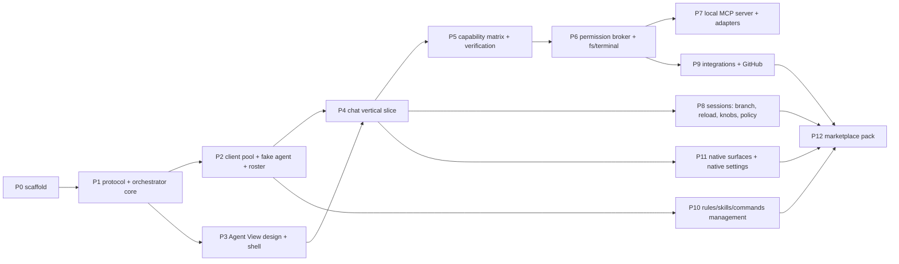

# acp-patchbay — Implementation Plan

Execution contract: Claude implements every phase; the owner's part is the named
touchpoints and gap clarifications — nothing else. Inputs: [prd.md](prd.md),
[features.md](features.md), [architecture.md](architecture.md); on conflict they
win and the conflict is raised, not silently resolved. This document is state:
checkboxes reflect what is done, phases carry no history.

## Ground rules

- Stack is fixed: TypeScript everywhere in the extension host, esbuild, npm.
  No webpack, no second language, no framework beyond what is named below.
- The three architecture invariants hold in every phase: webviews are render-only;
  UI gates on verified, not declared; secrets touch `SecretStorage` and nothing
  else.
- One scoped commit per phase gate, message carrying what changed and why.
  Publishing to the Marketplace is manual, always.
- When `vscode-acp` already solves a subsystem (connection handling, chat
  rendering), its approach is checked first and credited where borrowed (MIT).
- Reference checkouts live at the workspace root, outside this repo, read-only:
  `vscode-acp` (baseline client + roster data source), `agent-client-protocol`
  (schema v1/v2 + protocol docs), `typescript-sdk` (SDK source + example agent
  and client).

## Toolchain calls

Each one buys its keep; each is removable without cascade:

- **`@agentclientprotocol/sdk`** (official ACP TypeScript SDK) for both sides:
  the client app in the pool, the agent app in the fake agent. Protocol
  plumbing is exactly what should not be hand-rolled. Built against schema v2;
  every RFD-stage assumption in architecture.md is re-verified against the
  SDK's types at P2. *Re-verified (P2): SDK 1.x replaced the 0.x
  `ClientSideConnection`/`AgentSideConnection` classes with the
  `client()`/`agent()` builder API — same stdio ndjson JSON-RPC, same methods;
  built on 1.1.0.*
- **Preact** for both webviews — a component model earns its keep for streaming
  chat; esbuild compiles JSX natively so it costs zero extra toolchain. State is
  pure reducers over patch events; no state library.
- **zod** for parsing everything that crosses a trust boundary: config file,
  roster, registry, agent `initialize` responses. One runtime dependency that
  converts malformed input into typed errors instead of undefined behavior.
- **vitest** for unit tests; **@vscode/test-electron** for a minimal activation
  suite; a **fake ACP agent** as the real test bed — the SDK's example agent
  (`typescript-sdk/src/examples/agent.ts`) as skeleton plus a scriptable
  behavior table: it can be told to lie (declare a capability, drop the calls;
  confirm a rejected mode change), which is the only way to test
  declared-vs-verified honesty deterministically.
- Config file `.vscode/acp-patchbay.json` is parsed as JSONC — humans edit it.

## Dependency graph

Solo execution order is P0→P12 numerically; the graph exists for stall handling —
when a phase blocks on a touchpoint, the next node with satisfied dependencies
proceeds (e.g. P3 awaiting design verdict does not block P5 logic work).

## Phases

### P0 — Scaffold ☑

- `package.json` (contributes: Agent View container/view, Settings command,
  activation events; `engines.vscode` pinned), `tsconfig.json`, `esbuild.mjs`
  (three bundles: extension host, agent-view webview, settings webview),
  `.vscodeignore`, `.gitignore`, vitest wiring, `LICENSE` (MIT), stub
  `README.md`/`CHANGELOG.md`, placeholder icon.
- Layout: `src/extension.ts`, `src/orchestrator/`, `src/mcp/`,
  `src/webview/{agent-view,settings}/`, `src/shared/`, `data/`, `test/`.
- **Gate**: Extension Development Host launches; empty Agent View renders;
  `npm test` runs green.

### P1 — Shared protocol + orchestrator core ☑

- `src/shared/protocol.ts`: action/snapshot/patch discriminated unions, revision
  scheme.
- Orchestrator state container; stores: session index (`workspaceState`),
  decision audit (JSONL appender in workspace storage), config reader/writer
  (JSONC + zod), permission-rules store (`workspaceState` + built-in defaults).
- Webview host plumbing: mount → hydrate → snapshot; patch bus with ~30 ms
  coalescing; revision gap → resnapshot. Same plumbing serves both webviews.
- **Gate**: unit tests prove reducer determinism, coalescing, gap-recovery; a
  dummy state round-trips through a real webview (kill/reopen included).

### P2 — ACP client pool + fake agent + roster ☑

- Client pool: `agentId → { process, declared, verified, sessions[] }`; spawn /
  stop / restart; crash detection surfacing as status patches; ACP `initialize`
  with `fs` + `terminal` advertised; declared table captured per connect.
- `test/fake-agent/`: scriptable fixture — declared capabilities, streamed
  turns, deliberate lies (declares fs, never calls it; reports mode change
  success while ignoring it), crash on demand, concurrent-session behavior knob.
- `data/roster.json`: known agents as data — name, launch command, install hint,
  rules/skills/commands location mapping, known quirks and observed `_meta`
  extension conventions (`_claude/*`, codex-acp terminal channel). Extracted from
  vscode-acp's shipped defaults (credited) — Copilot, Claude Code, Gemini, Qwen,
  Auggie, Qoder, Codex, and the rest — with location mappings completed for
  Claude Code and Augment.
- **Gate**: pool tests against fake agent — connect, capture declared, crash →
  visible → one-action restart, two concurrent sessions on one connection.

### P3 — Agent View design + shell ☑

- `docs/design/agent-view-mockup.html` and `docs/design/settings-mockup.html`:
  interactive single-file HTML mockups — visuals and interactions judged in a
  browser, iterated to verdict. The owner's reference images (workspace root)
  are the visual starting point.
- `docs/design/ui.md`: the binding inventory — every area, icon, and behavior
  of both surfaces, kept 1:1 with the mockups. The mockups illustrate; this
  doc binds.
- Implement the static shell from the approved design: regions, navigation
  gestures, empty states.
- **Gate / owner touchpoint**: mockup verdict, then requirements doc.

### P4 — Chat vertical slice ☑

- `session/new` → prompt → streamed `session/update` → patches → chat renders
  live: text, tool calls, thoughts, plans. Stop turn (`session/cancel`). Session
  index entries; switch / rename / close. Slash-command autocomplete from
  `available_commands_update`. Render cache rebuilt from `session/load` replay
  on reopen.
- **Gate**: full turn streams end-to-end against fake agent (automated) and
  Claude Code via ACP (manual smoke); webview kill/reopen mid-turn recovers.

### P5 — Capability matrix + verification ☑

- Declared/verified tables per agent; verified resets on reconnect;
  protocol-level auto-verification on connect (fork round-trip, MCP transports);
  opportunistic behavior-level marking hooks (first fs success, first
  elicitation, first usage report); explicit diagnostics path — cost disclosed,
  ephemeral session in a temp dir, never workspace roots.
  *Scoped at build time: fs success, elicitation, and MCP-transport
  verification need handlers that don't exist until P6 (broker + fs/terminal),
  P7 (local MCP server, elicitation adapter), and P9 (real http/sse MCP
  connections) respectively — wiring a "verified" path for them now would
  have nothing honest behind it. What P5 actually wires: the fork round-trip
  (automatic, free), and three opportunistic signals buildable today — first
  `usage_update`, first successful `session/load`, and a second concurrent
  `session/new` on one connection. The remaining rows sit at declared or
  not-declared until their phase lands, which is the correct state for them
  to be in right now.*
- Matrix UI in Settings (three states per row); fidelity label as the pure
  function from architecture; roster-sourced asset-location row.
- **Gate**: fake agent scripted to lie shows declared-but-unverified; branch
  affordance lights only after verified fork; reconnect drops verified.

### P6 — Permission broker + editor depth (fs/terminal) ☑

- One broker path for ACP `session/request_permission`, MCP tool calls, and
  terminal execution; allow-once / allow-always / reject; rules evaluated from
  `workspaceState`; decision audit writes; native notification when the view is
  hidden; repo-defined agent → one-time adoption prompt behind workspace trust.
- `fs/read_text_file` serves live buffers; `fs/write_text_file` → pre-gated
  native diff (rules can auto-accept; diff stays visible); terminal in a visible
  pseudoterminal, same gating.
  *Scoped at build time: "MCP tool calls" has nothing to gate yet — the local
  MCP server doesn't exist until P7; the broker's mechanism is ready and P7
  routes tool calls through the same `evaluateCommand`/`evaluateFileWrite`
  path, no new broker surface needed. The agent's own `session/request_permission`
  for an `execute`-kind tool can't be rule-matched reliably — ACP has no
  standard field carrying the command string for that call (only `edit`-kind
  gets one, via `toolCall.locations`), so that path honestly always asks;
  real enforcement is patchbay's own mandatory `terminal/create` gate, which
  does have the real command string. "Visible pseudoterminal" is ui.md's chat
  terminal card (▣, live-streaming, exit status) — the binding UI spec never
  calls for a second, separate native VS Code terminal panel, so building one
  would be additive scope beyond what's specified.*
- **Gate**: automated broker tests (rule precedence, audit trail); manual smoke —
  agent edit arrives as diff, reject leaves disk untouched.

### P7 — Local MCP server + adapters ☑

- Stdio MCP server passed via `mcpServers` at `session/new`: selection, current
  file, diagnostics, open editors; roots. Adapter fallbacks per handshake:
  elicitation → `request_user_input` tool, roots → prompt injection,
  subscribe → `get_workspace_state`.
- Prompt enrichment: image paste (`ContentBlock::Image` vs temp-file
  `ResourceLink` — never disabled), file attach (`embeddedContext` gate),
  explicit add-selection/file/diagnostics, right-click actions.
- **Gate**: real agent reads selection + diagnostics in a turn (which
  opportunistically verifies those rows); fallback paths covered by fake agent
  with capabilities stripped.
  *Scoped at build time:*
  1. *The local MCP server is a genuinely new architectural piece: it's
     spawned by the **agent**, not patchbay, so it can't reach vscode APIs
     directly — a small IPC bridge (`src/mcp/ipc-protocol.ts`) carries tool
     calls back to an orchestrator-side host (`editor-state-host.ts`) that
     has real `vscode.window`/`workspace`/`languages` access. The MCP server
     is spawned with a patchbay-minted correlation token, not the real ACP
     sessionId — session/new hasn't returned one yet when `mcpServers` must
     already be in the request — mapped to the real sessionId once it is
     (only matters for `request_user_input`, which needs to know which
     transcript to post the form into; the other tools return global,
     session-agnostic editor state).*
  2. *Tools only, no MCP resources at all — every agent's MCP client supports
     basic tool calling, resources/subscribe support doesn't, so this is one
     uniform path rather than a primary+fallback pair. `get_workspace_state`
     **is** the resources.subscribe fallback, not one of two mechanisms —
     the "subscribe → get_workspace_state" adapter row collapses to "always
     get_workspace_state."*
  3. *Elicitation ships as the MCP tool fallback only — `request_user_input`
     — never native ACP elicitation. The SDK marks `ElicitationCapabilities`
     UNSTABLE/experimental; building a JSON-Schema-driven native handler
     against admittedly-unfinished protocol surface isn't a good trade for
     v1, especially when the fallback achieves the identical user-facing
     outcome and works with every agent's MCP client regardless of ACP-level
     support. `clientCapabilities.elicitation` stays undeclared.*
  4. *Context **roots** (`additionalDirectories` — adding external folders
     beyond the workspace to a session, features.md's "Roots chip") is not
     wired. Same call as image paste / file attach / right-click: real,
     separate UI mechanisms layered on existing protocol fields, not the
     architectural bet this phase exists to prove. What P7 does ship —
     explicit add-selection/add-file/add-diagnostics via the composer's
     adder, injected as their own labeled prompt blocks — is the piece that
     needed the new IPC plumbing to exist at all.*
  5. *Real vscode-backed data (`EditorStateHost`) is covered by test-electron
     (opens a real document, sets a real selection); the wire protocol, tool
     routing, and the full pool→agent→MCP-server→IPC chain are covered by
     vitest against a stand-in host — genuinely spawning the real bundled
     `out/mcp-server.js` and, in the end-to-end tests, a fake agent that acts
     as a real MCP client too, not a mock of either side.*

### P8 — Sessions advanced ☑

- Session graph (parent → branches); native `session/fork` when verified, else
  emulated seed — labeled; one-click reload (re-`load` replay); last-known view
  files + emulated continuation for non-replay agents; model/mode/effort knobs
  from agent options with per-agent defaults applied post-create, display from
  confirmed state only; process policy auto/shared/isolated with fork pinned to
  parent, shown.
- **Gate**: branch on fake agent with and without fork capability produces
  correctly labeled graph nodes; policy `isolated` isolates `session/new` only.
- *Five scoping calls, each identified while implementing rather than assumed
  upfront:*
  - *`AgentPool` gained a second, invisible-to-`list()` connection kind
    ("isolated instances", keyed separately from the real agentId, reported
    back to hooks via a `reportAs` field) rather than a parallel pool class —
    every existing call site (newSession/fork/prompt/cancel/loadSession/stop/
    restart) already took a connection key, so the change is additive: same
    methods, a second kind of key.*
  - *`concurrentSessions` verification now fires from `AgentPool.fork()` too,
    not only `newSession()`'s second-session case — a fork's parent is always
    already on the connection, so any successful fork is structurally the same
    proof (2+ sessionIds live on one connection) the row claims to measure.
    This is what lets "auto" policy bootstrap toward sharing without patchbay
    ever risking an unverified top-level `session/new` to find out — the first
    branch a user makes (on any policy) verifies it for every later decision.*
  - *Model/mode/effort have no row in the capability matrix — architecture.md's
    fixed row list has none, and unlike fs/terminal/fork these aren't
    "capabilities" in the declared/verified sense: presence alone (does the
    agent offer this knob at all) is the only honesty question, answered fresh
    from every session/new, /load, and /fork response plus `current_mode_update`
    / `config_option_update` notifications — never the set-request's own
    response, which bridges have been known to report as success regardless.*
  - *Per-agent defaults (`AgentConfig.defaults` / `processPolicy`) were already
    scaffolded in `config-file.ts` since P1 but never consumed — P8 is what
    reads them. Applied once, post-create only (never on reopen/reload/fork,
    which must show the agent's own resumed state, not re-force a default over
    a mid-conversation switch); matched to an offered config option by
    `category` (`"model"` / `"thought_level"`), never invented.*
  - *An emulated dead-end continuation (no `session/load`, connection died) and
    an emulated branch turned out to be the same mechanism — a fresh
    `session/new` with the transcript seeded wholesale from a source blocks
    array (the persisted last-known view in one case, the live parent
    transcript in the other). One private helper serves both; the only
    difference is where the seed blocks come from.*

### P9 — Integrations + GitHub ☐ (mechanism complete, blocked on owner touchpoints)

- `data/registry.json` (GitHub entry: id, name, transport, auth, scopes, bridge
  launch); custom MCP add (command/URL + auth); stdio-to-HTTP bridge process
  with token refresh; routing UI — per-agent attach, default auto-attach only
  fully-brokered; workspace-scoped storage in the config file; explicit share
  command that copies config and reattaches credentials only on confirm.
- OAuth grant: decide at phase start — default call is GitHub Device Flow (no
  client secret in an extension, works in remote/WSL); URI-handler callback only
  if device flow proves hostile in practice. *Decided: Device Flow, built as such.*
- **Gate**: GitHub connect → routed agent lists issues via MCP; disconnect
  revokes; token never appears outside `SecretStorage` (test greps logs/state).
- **Owner touchpoints**: create the GitHub OAuth app under the org; live smoke
  with Augment on the owner's machine.
- *Status: everything autonomously buildable is built and tested — real Device
  Flow client (`oauth-device-flow.ts`, RFC 8628, tested against a fake local
  HTTP provider), real stdio-to-HTTP bridge subprocess (`integration-bridge.js`,
  a 5th esbuild bundle) proven end-to-end with a real fake-agent process calling
  a fake remote MCP server's `list_issues` tool through it (including the 401
  retry-once path), registry + custom-integration + routing + share mechanism,
  `IntegrationTokenStore` (SecretStorage-only, `SecretsLike` structural
  interface so it's fakeable), and the Settings Integrations section. What
  remains is exactly the two named owner touchpoints, both genuinely
  account-bound and unreachable from this sandbox:*
  - *`data/registry.json`'s GitHub entry ships with `deviceCodeUrl`/`tokenUrl`
    filled in (GitHub's own stable, public Device Flow endpoints — the same
    for every OAuth App, safe to ship as data) but `clientId` and `url` left
    empty. Both are bound to the specific OAuth App this project registers —
    `url` because which remote MCP endpoint that app is authorized against is
    a property of how it's registered (personal-access-style vs. a GitHub App,
    which product surface, which scopes), not a public constant I can respond
    to instead of guessing. `isConnectable()` gates on both being non-empty, so
    Connect is inert, not silently wrong, until they're filled in.*
  - *The gate's "routed agent lists issues via MCP" is verified automatically
    (`test/integration-bridge.test.ts`) against a fake remote server standing
    in for whatever GitHub's is — that fake is honest about what it replaces
    (no network access, no real client_id here) but is not a live GitHub
    smoke test. Once the OAuth App exists, filling in `clientId`/`url` and
    running the Augment live smoke is what actually closes this phase's gate;
    no code change should be needed for that step given the mechanism above.*

### P10 — Rules, skills, commands management ☐

- Settings section reading each connected agent's native locations from roster
  mapping; view + edit in place; unmapped agents shown as unmapped. No delivery,
  no symlinks — v1 is management only.
- **Gate**: Claude Code and Augment file sets listed and editable; an unmapped
  roster agent renders the honest empty state.

### P11 — Native surfaces + native settings ☐

- Status bar (active session, health, usage when reported — absent when not);
  command palette: new/switch session, connect agent, open settings; permission
  notification already landed in P6 — verify coverage; VS Code native settings:
  default agent + telemetry opt-in, nothing else.
- **Gate**: every features §3 command palette item works; status bar click jumps
  to session.

### P12 — Marketplace pack ☐

- Real `README.md` (with vscode-acp credit), `CHANGELOG.md`, icon, `repository`
  field, categories/keywords, `vsce package` dry-run clean; final pass of the
  features inventory — every v1 bullet has a working path or a raised gap.
- **Gate / owner touchpoints**: publisher identity; the publish click itself —
  manual by rule.

## Owner touchpoints, complete list

1. **P3**: Agent View design verdict.
2. **P9**: GitHub OAuth app creation; Augment live smoke on your machine.
3. **P12**: publisher identity; manual publish.
4. Ad hoc: gap clarifications when a doc conflict or protocol surprise is hit —
   raised immediately with a proposed call, never silently resolved.

## Verification strategy

Automated per phase: vitest units (orchestrator, reducers, broker, stores),
fake-agent integration (pool, sessions, verification honesty), minimal
test-electron suite (activation, view registration, commands). Manual smoke per
phase against Claude Code over ACP in the dev host; Augment smoke at P9. The
fake agent's lying modes are the standing regression bed for bet #2 — every
honesty feature gets a test where the agent lies and the UI tells the truth.
