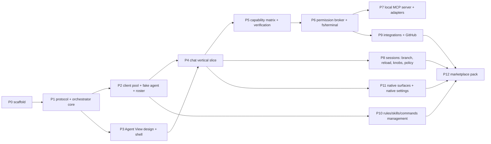

# acp-patchbay — Implementation Plan

Execution contract: Claude implements every phase; the owner's part is the named
touchpoints and gap clarifications — nothing else. Inputs: [prd.md](prd.md),
[features.md](features.md), [architecture.md](architecture.md); on conflict they
win and the conflict is raised, not silently resolved. This document is state:
checkboxes reflect what is done, phases carry no history.

## Ground rules

- Stack is fixed: TypeScript everywhere in the extension host, esbuild, npm.
  No webpack, no second language, no framework beyond what is named below.
- The three architecture invariants hold in every phase: webviews are render-only;
  UI gates on used, not declared; secrets touch `SecretStorage` and nothing
  else.
- One scoped commit per phase gate, message carrying what changed and why.
  Publishing to the Marketplace is manual, always.
- When `vscode-acp` already solves a subsystem (connection handling, chat
  rendering), its approach is checked first and credited where borrowed (MIT).
- Reference checkouts live at the workspace root, outside this repo, read-only:
  `vscode-acp` (baseline client + roster data source), `agent-client-protocol`
  (schema v1/v2 + protocol docs), `typescript-sdk` (SDK source + example agent
  and client).

## Toolchain calls

Each one buys its keep; each is removable without cascade:

- **`@agentclientprotocol/sdk`** (official ACP TypeScript SDK) for both sides:
  the client app in the pool, the agent app in the fake agent. Protocol
  plumbing is exactly what should not be hand-rolled. Built against schema v2;
  every RFD-stage assumption in architecture.md is re-verified against the
  SDK's types at P2. *Re-verified (P2): SDK 1.x replaced the 0.x
  `ClientSideConnection`/`AgentSideConnection` classes with the
  `client()`/`agent()` builder API — same stdio ndjson JSON-RPC, same methods;
  built on 1.1.0.*
- **Preact** for both webviews — a component model earns its keep for streaming
  chat; esbuild compiles JSX natively so it costs zero extra toolchain. State is
  pure reducers over patch events; no state library.
  *Amended (P13, ui-rendering-strategy.md): webviews move to **React** — the
  strategy's cornerstone dependencies (Streamdown, Radix) are React libraries,
  and the "zero extra toolchain" rationale that justified Preact evaporates
  once Tailwind/shadcn enter anyway; a decision re-derived after the pivot,
  not carried. Reducer-over-patch-events state model unchanged.*
- **zod** for parsing everything that crosses a trust boundary: config file,
  roster, registry, agent `initialize` responses. One runtime dependency that
  converts malformed input into typed errors instead of undefined behavior.
- **vitest** for unit tests; **@vscode/test-electron** for a minimal activation
  suite; a **fake ACP agent** as the real test bed — the SDK's example agent
  (`typescript-sdk/src/examples/agent.ts`) as skeleton plus a scriptable
  behavior table: it can be told to lie (declare a capability, drop the calls;
  confirm a rejected mode change), which is the only way to test
  declared-vs-used honesty deterministically.
- Config file `.vscode/acp-patchbay.json` is parsed as JSONC — humans edit it.

## Dependency graph

Solo execution order is P0→P12 numerically; the graph exists for stall handling —
when a phase blocks on a touchpoint, the next node with satisfied dependencies
proceeds (e.g. P3 awaiting design verdict does not block P5 logic work).

## Phases

### P0 — Scaffold ☑

- `package.json` (contributes: Agent View container/view, Settings command,
  activation events; `engines.vscode` pinned), `tsconfig.json`, `esbuild.mjs`
  (three bundles: extension host, agent-view webview, settings webview),
  `.vscodeignore`, `.gitignore`, vitest wiring, `LICENSE` (MIT), stub
  `README.md`/`CHANGELOG.md`, placeholder icon.
- Layout: `src/extension.ts`, `src/orchestrator/`, `src/mcp/`,
  `src/webview/{agent-view,settings}/`, `src/shared/`, `data/`, `test/`.
- **Gate**: Extension Development Host launches; empty Agent View renders;
  `npm test` runs green.

### P1 — Shared protocol + orchestrator core ☑

- `src/shared/protocol.ts`: action/snapshot/patch discriminated unions, revision
  scheme.
- Orchestrator state container; stores: session index (`workspaceState`),
  decision audit (JSONL appender in workspace storage), config reader/writer
  (JSONC + zod), permission-rules store (`workspaceState` + built-in defaults).
- Webview host plumbing: mount → hydrate → snapshot; patch bus with ~30 ms
  coalescing; revision gap → resnapshot. Same plumbing serves both webviews.
- **Gate**: unit tests prove reducer determinism, coalescing, gap-recovery; a
  dummy state round-trips through a real webview (kill/reopen included).

### P2 — ACP client pool + fake agent + roster ☑

- Client pool: `agentId → { process, declared, verified, sessions[] }`; spawn /
  stop / restart; crash detection surfacing as status patches; ACP `initialize`
  with `fs` + `terminal` advertised; declared table captured per connect.
- `test/fake-agent/`: scriptable fixture — declared capabilities, streamed
  turns, deliberate lies (declares fs, never calls it; reports mode change
  success while ignoring it), crash on demand, concurrent-session behavior knob.
- `data/roster.json`: known agents as data — name, launch command, install hint,
  rules/skills/commands location mapping, known quirks and observed `_meta`
  extension conventions (`_claude/*`, codex-acp terminal channel). Extracted from
  vscode-acp's shipped defaults (credited) — Copilot, Claude Code, Gemini, Qwen,
  Auggie, Qoder, Codex, and the rest — with location mappings completed for
  Claude Code and Augment.
- **Gate**: pool tests against fake agent — connect, capture declared, crash →
  visible → one-action restart, two concurrent sessions on one connection.

### P3 — Agent View design + shell ☑

- `docs/design/agent-view-mockup.html` and `docs/design/settings-mockup.html`:
  interactive single-file HTML mockups — visuals and interactions judged in a
  browser, iterated to verdict. The owner's reference images (workspace root)
  are the visual starting point.
- `docs/design/ui.md`: the binding inventory — every area, icon, and behavior
  of both surfaces, kept 1:1 with the mockups. The mockups illustrate; this
  doc binds.
- Implement the static shell from the approved design: regions, navigation
  gestures, empty states.
- **Gate / owner touchpoint**: mockup verdict, then requirements doc.

### P4 — Chat vertical slice ☑

- `session/new` → prompt → streamed `session/update` → patches → chat renders
  live: text, tool calls, thoughts, plans. Stop turn (`session/cancel`). Session
  index entries; switch / rename / close. Slash-command autocomplete from
  `available_commands_update`. Render cache rebuilt from `session/load` replay
  on reopen.
- **Gate**: full turn streams end-to-end against fake agent (automated) and
  Claude Code via ACP (manual smoke); webview kill/reopen mid-turn recovers.

### P5 — Capability matrix + verification ☑

- Declared/verified tables per agent; verified resets on reconnect;
  protocol-level auto-verification on connect (fork round-trip, MCP transports);
  opportunistic behavior-level marking hooks (first fs success, first
  elicitation, first usage report); explicit diagnostics path — cost disclosed,
  ephemeral session in a temp dir, never workspace roots.
  *Scoped at build time: fs success, elicitation, and MCP-transport
  verification need handlers that don't exist until P6 (broker + fs/terminal),
  P7 (local MCP server, elicitation adapter), and P9 (real http/sse MCP
  connections) respectively — wiring a "verified" path for them now would
  have nothing honest behind it. What P5 actually wires: the fork round-trip
  (automatic, free), and three opportunistic signals buildable today — first
  `usage_update`, first successful `session/load`, and a second concurrent
  `session/new` on one connection. The remaining rows sit at declared or
  not-declared until their phase lands, which is the correct state for them
  to be in right now.*
  *Amended post-P5: the "verified" state renamed to "used" — a single
  successful round-trip proves a path fired, not that it's certified
  correct, and "verified" overclaimed the latter. Marking a row used, which
  had been split between capability-verifier.ts's probe and separate direct
  emits in session-manager.ts, is now fully centralized in pool.ts (the sole
  channel that talks to an agent on the wire) via one `onCapabilityUsed`
  hook, called at the exact point each RPC succeeds or a notification's kind
  tag arrives. `capability-verifier.ts` was renamed `capability-tracker.ts`
  and no longer marks anything itself — only decides when to run the
  synthetic probe and persists what pool.ts reports.*
- Matrix UI in Settings (three states per row); fidelity label as the pure
  function from architecture; roster-sourced asset-location row.
- **Gate**: fake agent scripted to lie shows declared-but-not-used; branch
  affordance lights only after the fork is used; reconnect drops used.

### P6 — Permission broker + editor depth (fs/terminal) ☑

- One broker path for ACP `session/request_permission`, MCP tool calls, and
  terminal execution; allow-once / allow-always / reject; rules evaluated from
  `workspaceState`; decision audit writes; native notification when the view is
  hidden; repo-defined agent → one-time adoption prompt behind workspace trust.
- `fs/read_text_file` serves live buffers; `fs/write_text_file` → pre-gated
  native diff (rules can auto-accept; diff stays visible); terminal in a visible
  pseudoterminal, same gating.
  *Scoped at build time: "MCP tool calls" has nothing to gate yet — the local
  MCP server doesn't exist until P7; the broker's mechanism is ready and P7
  routes tool calls through the same `evaluateCommand`/`evaluateFileWrite`
  path, no new broker surface needed. The agent's own `session/request_permission`
  for an `execute`-kind tool can't be rule-matched reliably — ACP has no
  standard field carrying the command string for that call (only `edit`-kind
  gets one, via `toolCall.locations`), so that path honestly always asks;
  real enforcement is patchbay's own mandatory `terminal/create` gate, which
  does have the real command string. "Visible pseudoterminal" is ui.md's chat
  terminal card (▣, live-streaming, exit status) — the binding UI spec never
  calls for a second, separate native VS Code terminal panel, so building one
  would be additive scope beyond what's specified.*
- **Gate**: automated broker tests (rule precedence, audit trail); manual smoke —
  agent edit arrives as diff, reject leaves disk untouched.

### P7 — Local MCP server + adapters ☑

- Stdio MCP server passed via `mcpServers` at `session/new`: selection, current
  file, diagnostics, open editors; roots. Adapter fallbacks per handshake:
  elicitation → `request_user_input` tool, roots → prompt injection,
  subscribe → `get_workspace_state`.
- Prompt enrichment: image paste (`ContentBlock::Image` vs temp-file
  `ResourceLink` — never disabled), file attach (`embeddedContext` gate),
  explicit add-selection/file/diagnostics, right-click actions.
- **Gate**: real agent reads selection + diagnostics in a turn (which
  opportunistically verifies those rows); fallback paths covered by fake agent
  with capabilities stripped.
  *Scoped at build time:*
  1. *The local MCP server is a genuinely new architectural piece: it's
     spawned by the **agent**, not patchbay, so it can't reach vscode APIs
     directly — a small IPC bridge (`src/mcp/ipc-protocol.ts`) carries tool
     calls back to an orchestrator-side host (`editor-state-host.ts`) that
     has real `vscode.window`/`workspace`/`languages` access. The MCP server
     is spawned with a patchbay-minted correlation token, not the real ACP
     sessionId — session/new hasn't returned one yet when `mcpServers` must
     already be in the request — mapped to the real sessionId once it is
     (only matters for `request_user_input`, which needs to know which
     transcript to post the form into; the other tools return global,
     session-agnostic editor state).*
  2. *Tools only, no MCP resources at all — every agent's MCP client supports
     basic tool calling, resources/subscribe support doesn't, so this is one
     uniform path rather than a primary+fallback pair. `get_workspace_state`
     **is** the resources.subscribe fallback, not one of two mechanisms —
     the "subscribe → get_workspace_state" adapter row collapses to "always
     get_workspace_state."*
  3. *Elicitation ships as the MCP tool fallback only — `request_user_input`
     — never native ACP elicitation. The SDK marks `ElicitationCapabilities`
     UNSTABLE/experimental; building a JSON-Schema-driven native handler
     against admittedly-unfinished protocol surface isn't a good trade for
     v1, especially when the fallback achieves the identical user-facing
     outcome and works with every agent's MCP client regardless of ACP-level
     support. `clientCapabilities.elicitation` stays undeclared.*
  4. *Context **roots** (`additionalDirectories` — adding external folders
     beyond the workspace to a session, features.md's "Roots chip") is not
     wired. Same call as image paste / file attach / right-click: real,
     separate UI mechanisms layered on existing protocol fields, not the
     architectural bet this phase exists to prove. What P7 does ship —
     explicit add-selection/add-file/add-diagnostics via the composer's
     adder, injected as their own labeled prompt blocks — is the piece that
     needed the new IPC plumbing to exist at all.*
  5. *Real vscode-backed data (`EditorStateHost`) is covered by test-electron
     (opens a real document, sets a real selection); the wire protocol, tool
     routing, and the full pool→agent→MCP-server→IPC chain are covered by
     vitest against a stand-in host — genuinely spawning the real bundled
     `out/mcp-server.js` and, in the end-to-end tests, a fake agent that acts
     as a real MCP client too, not a mock of either side.*

### P8 — Sessions advanced ☑

- Session graph (parent → branches); native `session/fork` when verified, else
  emulated seed — labeled; one-click reload (re-`load` replay); last-known view
  files + emulated continuation for non-replay agents; model/mode/effort knobs
  from agent options with per-agent defaults applied post-create, display from
  confirmed state only; process policy auto/shared/isolated with fork pinned to
  parent, shown.
- **Gate**: branch on fake agent with and without fork capability produces
  correctly labeled graph nodes; policy `isolated` isolates `session/new` only.
- *Five scoping calls, each identified while implementing rather than assumed
  upfront:*
  - *`AgentPool` gained a second, invisible-to-`list()` connection kind
    ("isolated instances", keyed separately from the real agentId, reported
    back to hooks via a `reportAs` field) rather than a parallel pool class —
    every existing call site (newSession/fork/prompt/cancel/loadSession/stop/
    restart) already took a connection key, so the change is additive: same
    methods, a second kind of key.*
  - *`concurrentSessions` verification now fires from `AgentPool.fork()` too,
    not only `newSession()`'s second-session case — a fork's parent is always
    already on the connection, so any successful fork is structurally the same
    proof (2+ sessionIds live on one connection) the row claims to measure.
    This is what lets "auto" policy bootstrap toward sharing without patchbay
    ever risking an unverified top-level `session/new` to find out — the first
    branch a user makes (on any policy) verifies it for every later decision.*
  - *Model/mode/effort have no row in the capability matrix — architecture.md's
    fixed row list has none, and unlike fs/terminal/fork these aren't
    "capabilities" in the declared/verified sense: presence alone (does the
    agent offer this knob at all) is the only honesty question, answered fresh
    from every session/new, /load, and /fork response plus `current_mode_update`
    / `config_option_update` notifications — never the set-request's own
    response, which bridges have been known to report as success regardless.*
  - *Per-agent defaults (`AgentConfig.defaults` / `processPolicy`) were already
    scaffolded in `config-file.ts` since P1 but never consumed — P8 is what
    reads them. Applied once, post-create only (never on reopen/reload/fork,
    which must show the agent's own resumed state, not re-force a default over
    a mid-conversation switch); matched to an offered config option by
    `category` (`"model"` / `"thought_level"`), never invented.*
  - *An emulated dead-end continuation (no `session/load`, connection died) and
    an emulated branch turned out to be the same mechanism — a fresh
    `session/new` with the transcript seeded wholesale from a source blocks
    array (the persisted last-known view in one case, the live parent
    transcript in the other). One private helper serves both; the only
    difference is where the seed blocks come from.*

### P9 — Integrations + GitHub ☑ (mechanism + curated registry; live smoke remains)

- `data/registry.json` (curated entries: id, name, endpoint, auth shapes,
  docs link, honest per-entry note); custom MCP add (command/URL + auth);
  stdio-to-HTTP bridge process with token refresh; routing UI — per-agent
  attach, default auto-attach only fully-brokered; workspace-scoped storage
  in the config file; explicit share command that copies config and
  reattaches credentials only on confirm.
- OAuth grant: decide at phase start — default call is GitHub Device Flow (no
  client secret in an extension, works in remote/WSL); URI-handler callback only
  if device flow proves hostile in practice. *Decided at phase start as Device
  Flow, built as such — then **superseded** after owner-directed research
  (docs/reference-mcp-oauth.md, the standing auth reference): the per-service
  OAuth-App route is dropped entirely. What ships instead: (1) a static key in
  a configurable header (`{headerName}: {valuePrefix}{key}`) as the v1 floor
  for every integration — covers GitHub-via-PAT, Stitch's `X-Goog-Api-Key`,
  Postman, and every other vendor's documented key path with zero OAuth
  surface and zero remote-environment failure modes; (2) MCP-spec OAuth 2.1
  (`mcp-oauth.ts`: RFC 9728 → 8414 discovery, RFC 7591 dynamic client
  registration, Authorization Code + PKCE) for vendors whose DCR is verified
  open (Stripe, Sentry, Postman-US, Supabase, Augment) — URL-only, no
  pre-provisioned credentials, refresh context captured with the token since
  the endpoints were discovered, not static. The redirect is the URI-handler
  route the original call reserved as fallback (`registerUriHandler` +
  `asExternalUri`), adopted deliberately because raw-loopback redirects are
  the *documented* remote-environment failure (reference doc, pitfall §1) —
  Device Flow's original justification. `oauth-device-flow.ts` removed. This
  also **removed the "create a GitHub OAuth App" owner touchpoint** — nothing
  to create; GitHub connects with a pasted PAT today.*
- **Gate**: connect (key paste, and OAuth against a fake spec-compliant
  provider with real DCR + PKCE verification) → routed agent lists issues via
  MCP through the real bridge subprocess; disconnect revokes; token never
  appears outside `SecretStorage`; gated DCR (Figma-style `client_name`
  allowlist) fails immediately and labeled, never a hang. All automated
  (`test/mcp-oauth.test.ts`, `test/integrations.test.ts`,
  `test/integration-bridge.test.ts`).
- **Owner touchpoint remaining**: live smoke on the owner's machine — a real
  vendor connect (GitHub PAT is the zero-setup candidate) and the Augment
  agent end-to-end. No code is expected to change for it.
- *The curated eight (GitHub, Figma, Stitch, Stripe, Sentry, Postman,
  Supabase, Augment Context Engine) ship as data with per-entry honesty:
  Figma remote is visible-but-not-connectable (no key mode, allowlisted DCR —
  its note names the Figma-Desktop `custom-stdio` alternative); Supabase and
  Augment take a user-pasted per-account endpoint. Full facts and binding
  implementation constraints live in docs/reference-mcp-oauth.md.*

### P10 — Rules, skills, commands management ☑

- Settings section reading each connected agent's native locations from roster
  mapping; view + edit in place; unmapped agents shown as unmapped. No delivery,
  no symlinks — v1 is management only.
- **Gate**: Claude Code and Augment file sets listed and editable; an unmapped
  roster agent renders the honest empty state.
- *"Edit in place" is VS Code's own editor, not a webview text-editor dialect:
  clicking a listed file sends `openAssetFile`, which the orchestrator resolves
  to `vscode.window.showTextDocument` — Settings indexes what's on disk (a
  single rules file, or every file inside a mapped commands/skills directory)
  and never reimplements editing (render-only-webview.md). Resolution itself
  (`asset-locations.ts`) is vscode-free behind a structural `FsLike`, unit-
  tested against a fake in-memory tree rather than requiring a real workspace
  on disk; the thin real `vscode.workspace.fs` wrapper is a few lines with
  nothing left to prove beyond what TypeScript already checks.*

### P11 — Native surfaces + native settings ☑

- Status bar (active session, health, usage when reported — absent when not);
  command palette: new/switch session, connect agent, open settings; permission
  notification already landed in P6 — verify coverage; VS Code native settings:
  default agent + telemetry opt-in, nothing else.
- **Gate**: every features §3 command palette item works; status bar click jumps
  to session.
- *Permission notification coverage verified by inspection, not new code: all
  three ask-paths (`broker.resolveAgentPermissionRequest`, `gateFileWrite`,
  `gateCommand`) already call the same `notifyPending` hook since P6 — one
  surface, confirmed, nothing to add.*
- *Scope call: "telemetry opt-in" is dropped, not built as a dead toggle. This
  project collects no telemetry anywhere in the codebase — no event ever
  leaves the extension host. A settings toggle that gates nothing is worse
  than no toggle (the "no half-finished implementations" rule): if telemetry
  is ever added, the opt-in ships alongside the first thing it actually
  controls, not years ahead of it as an inert checkbox. `defaultAgent` ships
  for real — connects once, only when nothing is connected yet, never
  overriding a user's own choice; this is the user's configured pick, not
  patchbay routing among agents (prd.md's routing scope decision is about
  choosing an agent for a given task, a different question).*
- *Status bar / command palette logic (`status-bar.ts`) is vscode-free and
  unit-tested, same shape as every other native-surface-adjacent module in
  this codebase; `ChannelHost` gained a small `onChange` subscription (used
  by nothing else yet) so native surfaces can react to canonical state
  without being a webview, per architecture.md's "direct orchestrator
  consumers: same state, no webview in the path."*

### P12 — Marketplace pack ☑ (mechanism/audit complete; publish itself is the owner touchpoint)

- Real `README.md` (with vscode-acp credit), `CHANGELOG.md`, icon, `repository`
  field, categories/keywords, `vsce package` dry-run clean; final pass of the
  features inventory — every v1 bullet has a working path or a raised gap.
- **Gate / owner touchpoints**: publisher identity; the publish click itself —
  manual by rule.
- *Marketplace metadata (`repository`, `categories`, `keywords`, `icon`,
  `license`, `engines.vscode`, `publisher: solutionsunity`) was already
  complete from P0 — this phase's own contribution is a real README (was a
  9-line stub) and a clean `vsce package` dry run (145.96 KB, 15 files, no
  warnings). Publisher identity is already set to the owner's own
  organization; the remaining touchpoint is confirming that publisher exists
  on the Marketplace (or creating it) before the manual `vsce publish` — not
  a code change.*
- *Features-inventory pass found real gaps and closed the ones sized for this
  phase, per the gate's explicit "working path or a raised gap":*
  - *Small, mechanical gaps (existing backend, missing UI trigger only): a
    **Stop** button for running agents (the `stopAgent` action existed since
    P2, never wired to a control); Settings § Agents gained a full add/edit/
    remove form for workspace agent launch config (`upsertAgent`/`removeAgent`
    existed since P1, never exposed) — connecting a saved config reuses the
    existing `connectAgent` action via a new `{ configuredId }` source
    variant; a right-click "Add Selection to Patchbay Context" editor-context
    command (reuses the composer's own add-selection action).*
  - *Three features.md bullets — image paste, file attach, context roots
    (`additionalDirectories`) — were explicitly deferred at P7 ("separate UI
    mechanisms... NOT this phase's architectural bet") but never assigned a
    landing phase in P8–P11. Treated as the exact kind of gap the kickoff
    instruction says to raise rather than resolve silently: closed now,
    since every v1 bullet needing a working path is literally this phase's
    gate. Image paste and file attach both ride the existing `ContextChip`
    mechanism (image is a new chip kind carrying base64 + mimeType, sent in
    the best form the agent accepts — see the final-audit entry, which
    superseded this bullet's original "ImageContent regardless" call;
    file-picker attach reuses the same shape as
    "add current file," just for an arbitrary picked file); "attach by
    drag-and-drop **or** picker" is satisfied by the picker alone — drag-drop
    specifically wasn't added, a scope trim not a gap, since the bullet is an
    OR. Context roots plug into `additionalDirectories` (`session/new` /
    `/load` / `/fork`, real ACP fields, not invented) — patchbay tracks only
    the user-added external ones (workspace folders are always active and
    need no chip); since ACP has no live-update request for this field, a
    root added mid-session honestly reaches the agent only on the next
    reload/branch, surfaced in the UI rather than hidden.*
  - *Fixed a real pre-existing bug found while wiring context roots through
    `reopen()`: reconnecting a crashed session via `session/load` never
    re-attached the local MCP server or any integrations (no `mcpServers`
    was passed at all) — silently regressing P7/P9's whole depth story after
    any crash+reload. Now mints a fresh correlation token and rebuilds the
    same `mcpServers` list `createSession` gets.*
  - *Editing an agent's own live-connection launch config only takes effect
    on next connect/restart, same as workspace-config agents always have —
    not a new limitation introduced here.*

### Final pre-publish audit ☑ (2026-07-06 — full-codebase review against the docs)

- *Fixed (mechanical, doc-backed):*
  - *`fs.readTextFile` / `fs.writeTextFile` / `terminal` had **no verification
    path at all** — P5's scoping note deferred their opportunistic hooks to
    P6's real handlers, P6 built the handlers but the marking never landed.
    Consequence in production: no agent could ever reach fully-brokered (every
    agent wore "acts outside" permanently, even fully-gated ones) and `auto`
    integration routing could never attach anything. Now wired in the
    orchestrator's pool hooks (first read / first gated write — a rejected
    write still counts, rejection is the broker working / first accepted
    terminal), guarded against event spam; covered by a new test-electron
    case driving all three through the real orchestrator.*
  - *The automatic fork probe left its two throwaway sessions in the
    connection's session set forever — process-policy `auto` read them as
    real concurrent sessions (`hasExisting`) and, whenever the fork half of
    the probe failed, needlessly isolated the user's first top-level session.
    Probe sessions are now forgotten in the probe's `finally`.*
  - *Chat blocks clipped instead of scrolling once a transcript outgrew the
    view: `.chat` is a flex column and `.card`'s `overflow: hidden` zeroes
    its automatic minimum size, so cards compressed — permission buttons
    half-visible, terminal output cut. Caught by the headless-screenshot
    pass; fixed with `flex-shrink: 0` on chat blocks.*
  - *Stale doc references to the superseded Device Flow aligned to the
    recorded P9v2 decision (features.md's GitHub bullet, ui.md § Integrations
    — supersession noted in place, not erased). The two mockup HTML files
    still illustrate the old device-flow modal — mockups lag, ui.md binds.*
- *Resolved by owner direction (post-audit round):*
  - *Image paste now honors the declared capability: `promptCapabilities.image`
    → real `ContentBlock::Image`; undeclared → bytes to a temp file, sent as
    a `ResourceLink` (the baseline every agent must accept) — code and
    architecture.md now agree; P12's "ImageContent regardless" call is
    superseded.*
  - *Plan strip mirrors only what the agent reports (owner: "whatever the
    agent reports for plan we need to reflect"): the last reported plan
    stays up — no invented clearing signal, since ACP has none — and a
    transcript reset (reload/replay) clears it so replay alone rebuilds it.
    The never-emitted `planCleared` event is removed as dead protocol
    surface.*
  - *The ui.md-bound controls are built: composer selection ghost chip (live
    IDE selection, position streamed — text read only on solidify) and `@`
    context mention picker (open editors + the adder's entries); chat crash
    banner with one-action Restart; Settings stat tiles, full per-agent
    cards (launch command mono, Stop, crashed note + Restart, process-policy
    select with its auto reason, default knobs enabled only where the agent
    has actually offered them — observed via a new settings-side knob
    projection), the diagnostics cost-disclosure modal, and the explicit
    plug-in confirmation when routing onto a less-than-fully-brokered
    agent.*
- *Still raised (owner calls pending):
  integration MCP tool calls run ungated by the broker — one mechanism
  across both transports; the bridge (registry/custom-http) path is
  gateable since patchbay owns that proxy, custom-stdio would need the same
  proxy inserted (v1 relies on the agent's own brokered
  `session/request_permission` plus explicit routing consent); registry
  ships Augment `oauth: true` while reference-mcp-oauth.md marks its DCR
  openness unverified (owner is live-testing); custom-stdio `env` in the
  repo-shareable config file is a user-side secret channel (hand-edit only —
  the UI never writes env; a warning note is the proposed fix). The two
  mockup HTML files still lag ui.md (device-flow modal, new controls) —
  mockups illustrate, ui.md binds.*

### P13 — UI rendering strategy (ui-rendering-strategy.md) ☐

One shared component layer (shadcn/Radix, Codicons, one VS Code-theme bridge)
across both webviews, and the chat transcript pipeline (Streamdown markdown +
block components) on the block model P4/P8 already built. Forces two recorded
stack decisions: webviews Preact→React (amended above) and Tailwind alongside
esbuild. Four sub-phases, each shipped and installed before the next:

- **P13a — foundation**: React swap; Tailwind v4 into the esbuild pipeline;
  shadcn init (source-copied components, never a black-box dep); the theme
  bridge written once (VS Code CSS vars → shadcn tokens — the strategy doc's
  single-bridge rule); Codicons re-pointed. CSP decision made explicitly at
  this step (Radix inline styles already allowed; Shiki = `wasm-unsafe-eval`
  or JS engine — never widened silently). Gate: one small surface converted
  and visually theme-correct in dark + light; all 216+ tests green.
- **P13b — chat view**: Streamdown for `agent_message_chunk`/`agent_thought_chunk`
  only (tool calls/diffs/plans never enter the markdown parser); tool-call
  cards (kind icons, collapsed default, permission-denied visually distinct
  from failed); thought auto-collapse; streaming caret; sequential tool-call
  grouping. Gate: fake-agent turn with interleaved text/thought/tool updates
  renders ordered, merged, and updated-in-place.
- **P13c — per-turn metadata + plan widget**: client-side duration (live
  ticker), completion-time tooltip, usage-when-reported (absence over fake),
  stop-reason chip only when not `end_turn`; plan pinned per session, manual
  expand only.
- **P13d — settings conversion**: `Field`/`Toggle`/`ConfirmButton` →
  shadcn `Form`/`Switch`/`AlertDialog`; the 3-group nav and every honesty
  behavior (write-only env, two-step destructive confirm semantics, unobserved
  vs offered-nothing knob states) preserved exactly; hand CSS retires
  incrementally.

## Owner touchpoints, complete list

1. **P3**: Agent View design verdict.
2. **P9**: live smoke on your machine — a real vendor connect (GitHub PAT) and
   Augment end-to-end. *(The original "create a GitHub OAuth App" touchpoint
   was removed by the superseding auth decision — see P9 and
   docs/reference-mcp-oauth.md.)*
3. **P12**: publisher identity; manual publish.
4. Ad hoc: gap clarifications when a doc conflict or protocol surprise is hit —
   raised immediately with a proposed call, never silently resolved.

## Verification strategy

Automated per phase: vitest units (orchestrator, reducers, broker, stores),
fake-agent integration (pool, sessions, verification honesty), minimal
test-electron suite (activation, view registration, commands). Manual smoke per
phase against Claude Code over ACP in the dev host; Augment smoke at P9. The
fake agent's lying modes are the standing regression bed for bet #2 — every
honesty feature gets a test where the agent lies and the UI tells the truth.
